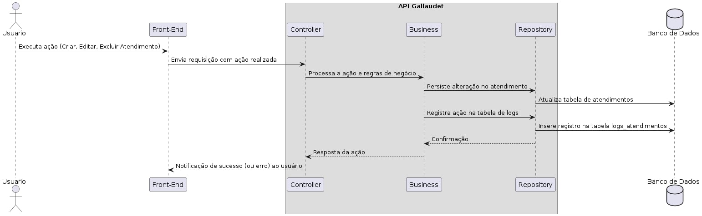

<div align="center">
  <a href="https://www.inteli.edu.br/">
    
  </a>
</div>

<br>

# Nome do Projeto: Gallaudet

# Nome do Grupo: ApoiaEdu

## Integrantes:

- <a href="https://www.linkedin.com/in/anna-riciopo/">Anna Giulia Marques Riciopo</a>
- <a href="https://www.linkedin.com/in/danielaraujogonncalves/">Daniel Augusto de Araujo Gonçalves</a>
- <a href="https://www.linkedin.com/in/joao-souza-campos/">João Victor de Souza Campos</a>
- <a href="https://www.linkedin.com/in/lucas-brasil9/">Lucas Paiva Brasil</a>
- <a href="https://www.linkedin.com/in/natalycunha/">Nataly de Souza Cunha</a>
- <a href="https://www.linkedin.com/in/otavio-vasc/">Otávio de Carvalho Vasconcelos</a>
- <a href="https://www.linkedin.com/in/thiagogomesalmeida/">Thiago Gomes de Almeida</a>

# Sumário

- [1. Introdução](#1-introdução)
  - [1.1 Termos e Abreviações](#11-termos-e-abreviações)
  - [1.2 Objetivo do Documento](#12-objetivo-do-documento)
- [2. Entendimento do Projeto e do Negócio](#2-entendimento-do-projeto-e-do-negócio)
  - [2.1 Contexto da Indústria do Parceiro](#21-contexto-da-indústria-do-parceiro)
  - [2.2 Problema](#22-problema)
  - [2.3 Visão do Projeto e do Produto](#23-visão-do-projeto-e-do-produto)
  - [2.4 Personas e Jornada do Usuário](#24-personas-e-jornada-do-usuário)
  - [2.5 Modelagem do Fluxo de Negócio](#25-modelagem-do-fluxo-de-negócio)
  - [2.6 Matriz de Risco do Projeto](#26-matriz-de-risco-do-projeto)
  - [2.7 Ideação](#27-ideação)
    - [2.7.1 Brainstorming de features](#271-brainstorming-de-features)
    - [2.7.2 Sequenciamento/Priorização de entregas](#272-sequenciamentopriorização-de-entregas)
  - [2.8 Canvas do Projeto](#28-canvas-do-projeto)
- [3. Requisitos do Projeto](#3-requisitos-do-projeto)
  - [3.1 Requisitos Funcionais (RFs)](#31-requisitos-funcionais-rfs)
  - [3.2 Requisitos Não Funcionais (RNFs)](#32-requisitos-não-funcionais-rnfs)
  - [3.3 Correlação RFs e RNFs](#33-correlação-rfs-e-rnfs)
- [4. Modelagem de Dados](#4-modelagem-de-dados)
  - [4.1 Modelo Conceitual de Dados](#41-modelo-conceitual-de-dados)
  - [4.2 Modelo Lógico de Dados](#42-modelo-lógico-de-dados)
  - [4.3 Modelo Físico de Dados](#43-modelo-físico-de-dados)
- [5. Solução Técnica (Design)](#5-solução-técnica-design)
  - [5.1 Diagrama de Componentes da UML](#51-diagrama-de-componentes-da-uml)
  - [5.2 Diagramas de Sequência da UML](#52-diagramas-de-sequência-da-uml)
- [6. Mapeamento Técnico de Infraestrutura e Implantação](#6-mapeamento-técnico-de-infraestrutura-e-implantação)
  - [6.1 Diagrama de Implantação da UML](#61-diagrama-de-implantação-da-uml)
  - [6.2 Justificativa das Escolhas de Implantação](#62-justificativa-das-escolhas-de-implantação)
  - [6.3 Considerações sobre Desempenho e Segurança](#63-considerações-sobre-desempenho-e-segurança)
- [7. Projeto Visual da Solução](#7-projeto-visual-da-solução)
  - [7.1 Desenvolvimento de Wireframes](#71-desenvolvimento-de-wireframes)
  - [7.2 Desenvolvimento de Mockups](#72-desenvolvimento-de-mockups)
  - [7.3 Guia Visual](#73-guia-visual)
- [8. Desenvolvimento do Projeto](#8-desenvolvimento-do-projeto)
  - [8.1 Arquitetura de Codificação e Estrutura de Diretórios](#81-arquitetura-de-codificação-e-estrutura-de-diretórios)
  - [8.2 Desenvolvimento de Features](#82-desenvolvimento-de-features)
    - [8.2.1 Sprint 3](#821-sprint-3)
    - [8.2.2 Sprint 4](#822-sprint-4)
    - [8.2.3 Sprint 5](#823-sprint-5)
  - [8.3 Testes Unitários e de Integração](#83-testes-unitários-e-de-integração)
  - [8.4 Documentações automáticas](#84-documentações-automáticas)
- [9. Planejamento e Execução de Testes](#9-planejamento-e-execução-de-testes)
  - [9.1 Testes Funcionais](#91-testes-funcionais)
    - [9.1.1 Planejamento](#911-planejamento)
    - [9.1.2 Resultados](#912-resultados)
  - [9.2 Testes de RNFs](#92-testes-de-rnfs)
    - [9.2.1 Planejamento](#921-planejamento)
    - [9.2.2 Resultados](#922-resultados)
  - [9.3 Testes de Usabilidade](#93-testes-de-usabilidade)
    - [9.3.1 Planejamento](#931-planejamento)
    - [9.3.2 Resultados](#932-resultados)
- [10. Procedimentos de Implantação](#10-procedimentos-de-implantação)
  - [10.1 Implantação e Configuração do Banco de Dados](#101-implantação-e-configuração-do-banco-de-dados)
  - [10.2 Implantação do Protótipo para uso por equipe de desenvolvimento](#102-implantação-do-protótipo-para-uso-por-equipe-de-desenvolvimento)
- [Referências](#referências)


# 1. Introdução
&emsp; Este documento apresenta a estrutura, requisitos e diretrizes para o desenvolvimento de uma solução destinada à Assessoria de Inclusão do Centro Paula Souza (CPS). A solução visa aprimorar o gerenciamento dos atendimentos aos alunos com necessidades especiais, substituindo o controle manual por um sistema digital eficiente e acessível. O documento abrange desde o entendimento do negócio até a implementação técnica, garantindo alinhamento com os objetivos do projeto.

## 1.1 Termos e Abreviações
Esta seção apresenta os principais termos e abreviações utilizados no projeto, garantindo um entendimento claro e padronizado da documentação.

| **Termo/Abreviação** | **Descrição** |
|----------------------|--------------|
| **API (Application Programming Interface)** | Interface que permite a comunicação entre diferentes sistemas e aplicações. |
| **CPS (Centro Paula Souza)** | Instituição pública de ensino técnico e superior do Estado de São Paulo. |
| **Etec (Escola Técnica Estadual)** | Escolas técnicas mantidas pelo Centro Paula Souza que oferecem cursos técnicos de nível médio. |
| **Fatec (Faculdade de Tecnologia do Estado de São Paulo)** | Faculdades de tecnologia mantidas pelo Centro Paula Souza, que oferecem cursos superiores tecnológicos. |
| **FAE (Ficha de Acompanhamento do Atendimento Educacional Especializado)** | Documento utilizado para registrar as necessidades educacionais especiais dos alunos atendidos pela Assessoria de Inclusão. |
| **LGPD (Lei Geral de Proteção de Dados)** | Lei brasileira que regula o tratamento de dados pessoais e garante a privacidade dos usuários. |
| **MVP (Minimum Viable Product)** | Versão inicial de um produto com funcionalidades essenciais para validação da solução. |
| **PCD (Pessoa com Deficiência)** | Pessoa que possui alguma limitação física, sensorial ou intelectual que impacta sua interação com o ambiente. |
| **UML (Unified Modeling Language)** | Linguagem de modelagem utilizada para especificar, visualizar e documentar sistemas de software. |
<br>

## 1.2 Objetivo do Documento
&emsp; O objetivo deste documento é detalhar as especificações funcionais e técnicas do sistema a ser desenvolvido, incluindo requisitos, modelagem de dados, arquitetura, design, desenvolvimento, testes e implantação. Ele serve como guia para todas as fases do projeto, garantindo clareza e alinhamento entre os envolvidos.

# 2. Entendimento do Projeto e do Negócio
&emsp;Esta seção busca detalhar o contexto de negócios do Centro Paula Sousa (CPS), bem como o problema apresentado pela empresa parceira que embasou o desenvolvimento deste projeto.

## 2.1 Contexto da Indústria do Parceiro
&emsp;O Centro Paula Sousa é uma autarquia sediada e voltada para o estado de São Paulo, oferecendo ensino profissional para cerca de 317 mil discentes em 345 municípios, dentro de escolas técnicas, faculdades de tecnologia e salas de aulas descentralizadas. Muitas das atividades exercidas no CPS se relacionam com a administração pública do Governo do Estado, devido à sua vinculação com a Secretaria de Ciência, Tecnologia e Inovação, buscando oferecer serviços educacionais com qualidade, governança e inclusão social (CPS, c2025).

&emsp;Observando-se o organograma do Centro, cada escola/faculdade representa uma unidade, gerida por um gestor ou coordenador. As operações de todas as unidades, no entanto, são monitoradas pelo cargo de Gestão Administrativa, que detém a visão analítica e estratégica das atividades educacionais, seus alunos e profissionais. Considerável parte dos alunos do CPS são pessoas com deficiência, apontando necessidade de atendimentos específicos. Com isso, cabe ao time de Acessoria de Inclusão — também composto por um servidor com deficiência visual — a oficializar essas solicitações através de uma Ficha de Acompanhamento do Atendimento Educacional Especializado (FAE); preparada essa ficha, um profissional externo é contratado para prestar o atendimento para o respectivo aluno (CPS, c2025).

&emsp;Nesse contexto, vale ressaltar que, segundo a Lei Brasileira de Inclusão da Pessoa com Deficiência - Lei 13.146/2015, o acesso à educação, ao trabalho, à mobilidade e tecnologias assistivas deve ser garantido para essa população na sociedade. Felizmente, em ambiente escolares e profissionais, são cada vez mais disseminadas e evoluídas tanto tecnologias assistivas — como leitores de tela, tradutores de libras, recursos digitais — quanto atendimentos especializados, o que demonstra a crescente oferta e aprimoramento de soluções tecnológicas que auxiliem pessoas com deficiência em suas atividades cotidianas.

## 2.2 Problema
&emsp;Em relação à administração das informações pessoais dos alunos com deficiência do Centro Paula Sousa e dos atendimentos especializados, apesar da utilização de sistemas digitais para armazenar os dados dessas frentes, não se tem a centralização dos detalhes dos atendimentos em um único lugar, cabendo à Gestão de Administração realizar manualmente o levantamento e cruzamento dessas informações, através de formulários e planilhas digitais. Dessa forma, o presente projeto pretende erradicar esse problema de descentralização de dados, de forma a garantir eficiência e diminuição de erros manuais para o trabalho da administração central do CPS, integrando também recursos de acessibilidade, garantindo a inclusão dos profissionais da Acessoria de Inclusão, como apontado na lei Lei 13.146/2015.

## 2.3 Visão do Produto e do Projeto.
&emsp;Segue a Visão do Produto Gallaudet, além das definições do Produto, o que ele "faz", "não faz", "é", "não é" e também os seus benefícios. Além disso, segue também os objetivos de negócio do Projeto.

### 2.3.1 Visão do Produto
- **Para** gestores e assessores das Fatecs e Etecs;
- **Que** precisam acompanhar e organizar o suporte aos alunos com deficiência;
- **O** Gallaudet é um sistema de gestão assistiva;
- **Que** automatiza a captação de dados dos alunos, facilita a alocação de profissionais e melhora o acompanhamento das necessidades assistivas;
- **Diferente** de planilhas e processos manuais;
- **Nosso produto** oferece um ambiente centralizado, acessível e integrado aos sistemas governamentais.

### 2.3.2 O Que é o Produto
&emsp;A solução desenvolvida tem como objetivo gerenciar os alunos com deficiência nas Fatecs e Etecs da cidade de São Paulo, garantindo que suas necessidades assistivas sejam atendidas e gerenciadas de maneira eficiente. Para isso, a plataforma **automatiza a captação de dados, permite a gestão de recursos assistivos e de profissionais de apoio, fornecendo também informações gerenciais para a tomada de decisão de gerentes dessas instituições**.

### 2.3.3 Características do Produto
&emsp;Segue as espeficicações do que o Produto "é" e "não é".

| **É** | **Não É** |
|---|---|
| Um sistema de gestão de alunos com deficiência de Fatecs e Etecs | Um sistema genérico de gestão acadêmica |
| Uma plataforma integrada à API governamental |  Um sistema manual de cadastro de alunos |
| Uma ferramenta para alocar recursos assistivos e profissionais de apoio | Um software de ensino ou aprendizagem |
| Uma solução acessível e compatível com o NVDA | Um sistema exclusivamente para alunos sem deficiência |
| Um gerenciador de métricas e dados geográficos | Um CRM ou ferramenta de marketing |

### 2.3.4 Funcionalidades do Produto
&nbsp;A seguir estão a definição do que o produto "Faz" e o que ele "Não Faz".
| **Faz** | **Não Faz** |
|---|---|
| Importa automaticamente os dados de alunos com deficiência do sistema governamental | Criar ou modificar dados externos do governo |
| Permite o cadastro e a gestão de profissionais proporcionam apoio aos estudantes  | Realizar pagamentos ou gerenciar contratos financeiros |
| Organiza e exibe recursos assistivos necessários para cada aluno | Monitorar desempenho acadêmico dos alunos |
| Cria uma linha do tempo com eventos e necessidades que foram atendidas para cada aluno | Substituir totalmente a gestão presencial dos alunos |
| Fornece métricas e dados geográficos via dashboard sobre os alunos que a assesoria de inclusão atendeu| Realizar diagnósticos médicos ou emitir laudos |


### 2.3.5 Benefícios do Produto (Comparação com a Situação Atual)
&emsp;No intuito de compreender os benefícios do produto, segue a comparação com a situação atual do CPS e a sua situação após a solução.

| **Situação Atual** | **Com a Solução** |
|---|---|
| Processos manuais, demorados e sujeitos a erro | Cadastro automático dos alunos com deficiência via API |
| Dificuldade em gerenciar profissionais de apoio e recursos assistivos | Plataforma que permite atribuir profissionais e recursos a cada aluno |
| Falta de acompanhamento estruturado da evolução e necessidades dos alunos | Linha do tempo detalhada, registrando eventos e observações sobre cada aluno |
| Ausência de dados centralizados para análises gerenciais | Dashboard com métricas estratégicas e dados geográficos para apoio na tomada de decisão |
| Sistema não acessível para usuários com deficiência visual | Plataforma 100% compatível com o NVDA para garantir inclusão digital |

### 2.3.6 Objetivos de Negócio do Projeto
1. **Centralizar a Gestão de Alunos com Deficiência**: Criar um ambiente único e acessível para visualizar dados dos alunos com deficiência, incluindo suas necessidades assistivas e histórico de atendimento.

2. **Automatizar a Importação de Dados**: Eliminar o trabalho manual de cadastro, integrando-se a um sistema governamental via API para obter automaticamente os dados dos alunos.

3. **Melhorar a Alocação de Recursos e Profissionais**: Permitir que gestores associem alunos a recursos assistivos e profissionais de apoio de forma organizada e rastreável, garantindo que cada aluno receba o suporte necessário.

4. **Facilitar a Tomada de Decisão Gerencial**: Oferecer dashboards e métricas para que gestores possam analisar dados estratégicos, como distribuição de alunos por tipo de deficiência e disponibilidade de recursos em diferentes unidades.

5. **Garantir Acessibilidade Digital**: Tornar o sistema compatível com leitores de tela (NVDA), garantindo inclusão digital e autonomia para usuários com deficiência visual.

## 2.4 Personas e Jornada do Usuário
&emsp;Para garantir que a plataforma Gallaudet atenda de forma eficiente às necessidades de seus usuários, é fundamental entender quem são essas pessoas, quais desafios enfrentam e como interagem com o sistema.

&emsp;A criação de personas e o mapeamento da jornada do usuário são práticas essenciais no desenvolvimento de produtos, pois ajudam a visualizar como diferentes perfis utilizam a solução no dia a dia.

### Por que criamos personas?
&emsp;As personas representam perfis fictícios baseados em usuários reais do sistema, descrevendo suas funções, desafios e expectativas. Elas nos ajudam a tomar decisões mais precisas no desenvolvimento da plataforma, garantindo que o sistema seja útil e acessível para aqueles que realmente precisam dele.

### Por que mapear a jornada do usuário?
&emsp;A jornada do usuário descreve o caminho que cada persona percorre ao interagir com o sistema. Isso permite identificar pontos de dor, oportunidades de melhoria e necessidades específicas, garantindo que o Gallaudet resolva problemas reais de forma eficiente.

### Persona 1 - Ana Beatriz
<div align="center">
  <sub>Figura X - Persona Ana Beatriz</sub> <br>

  

  <sup>Fonte: Material produzido pelos autores (2025).</sup>
</div>

#### **Persona: Ana Beatriz – Gestora Local (de Unidade)**
- **Nome:** Ana Beatriz

- **Idade:** 37 anos

- **Cargo:** Coordenadora Pedagógica / Orientadora Educacional

- **Local de Trabalho:** Fatec/Etec – Centro Paula Souza

- **Proficiência em Tecnologia:** Média (consegue usar sistemas administrativos, mas prefere interfaces intuitivas)

#### **Necessidades**
- Histórico dos alunos unificado, evitando a dificuldade na busca de informações.

- Obter um retorno rápido sobre os dados enviados, evitando informações desatualizadas.

- Padronização nos registros, evitando inconsistências.

- Identificar quais alunos precisam de profissionais.

#### **Como é a Ana Beatriz?**
- Organizada e comprometida com a inclusão dos alunos PCD.

- Paciente e empática, pois lida diretamente com alunos e suas famílias.

- Gosta de processos claros e bem estruturados, mas **não tem tempo para sistemas burocráticos**.

- Se frustra com a **falta de retorno rápido sobre os dados enviados**.

#### **O que Ana Beatriz faz?**
- Realiza entrevistas com as famílias dos alunos PCD para entender suas necessidades.

- Registra e acompanha atendimentos dentro da unidade escolar.

- Identifica alunos que precisam de atendimento e solicita profissionais para auxiliá-los.

- Atualiza informações sobre atendimentos e necessidades dos alunos na plataforma.

### Jornada de Usuário da Ana Beatriz (Gestora Local de Unidade)
<div align="center">
  <sub>Figura X - Jornada de Usuário da Ana Beatriz</sub> <br>

  

  <sup>Fonte: Material produzido pelos autores (2025).</sup>
</div>

**Objetivo:** Garantir que os dados dos alunos estejam atualizados, vinculando profissionais e organizando atendimentos.

#### Jornada Passo a Passo

1. **Receber novas informações sobre alunos PCD**
    - Ana Beatriz recebe uma solicitação de atendimento de um aluno.

    - Atualmente, o processo exige preenchimento de formulários e envio manual de e-mails.

    - **Com a solução:** O sistema centraliza as informações e gera alertas para novos registros.

2. **Acessar o sistema e buscar o aluno**
    - Entra na plataforma Gallaudet e utiliza a busca para encontrar o aluno.

    - Caso o aluno não esteja cadastrado, pode incluí-lo via API.

    - **Com a solução:** A busca é rápida e permite filtros avançados.

3. **Consultar o histórico e atualizar dados**

    - Verifica o histórico de atendimentos do aluno.

    - Se necessário, insere novas informações (exemplo: mudança de necessidade especial).

    - **Com a solução:** O sistema permite edições rápidas e mantém logs de alterações.

4. **Vincular o aluno a um profissional**

    - Identifica se o aluno já tem um profissional de atendimento designado.

    - Caso não tenha, busca na lista de profissionais cadastrados.

    - **Com a solução:** O sistema sugere profissionais disponíveis e agiliza o processo de vinculação.

5. **Registrar um novo atendimento**

    - Caso o aluno já esteja sendo atendido, Ana Beatriz adiciona novos registros ao histórico.

    - **Com a solução:** Os registros são salvos automaticamente, eliminando o risco de perda de dados.

6. **Gerar relatórios e enviar para a gestão administrativa**

    - Ao final do mês, precisa consolidar informações para a gestão administrativa.

    - **Com a solução:** O sistema gera relatórios automáticos, economizando tempo.

#### **Pontos de Contato e Desafios**

**Ponto de contato:** Sistema Gallaudet como ferramenta principal de gestão.

**Desafio:** Antes, os registros eram feitos manualmente e demoravam para serem atualizados.

**Solução:** O sistema centraliza e automatiza o fluxo de informações.

<br>

### Persona 2 - Carlos Mendes – Profissional de Atendimento
<div align="center">
  <sub>Figura X - Persona Carlos Mendes</sub> <br>

  

  <sup>Fonte: Material produzido pelos autores (2025).</sup>
</div>

- **Nome:** Carlos Mendes

- **Idade:** 42 anos

- **Cargo:** Psicólogo da Assessoria de Inclusão

- **Local de Trabalho:** Fatec/Etec – Centro Paula Souza

- **Proficiência em Tecnologia:** Baixa a Média (usa apenas o necessário para registrar atendimentos)

#### **Necessidades**
- Um sistema contendo o histórico do aluno, evitando retrabalho durante a consulta com o mesmo.

- Histórico com os atendimentos do aluno, evitando a dificuldade de dar continuidade nos acompanhamentos.

- Um sistema para registrar informações com facilidade, pois os processos atuais são manuais.

#### **Como é o Carlos Mendes?**
- Atencioso e empático, pois lida diretamente com alunos com deficiência.

- Prático e objetivo, prefere **sistemas simples e rápidos** de usar.

- Se frustra com **processos burocráticos e sistemas complexos**.

#### **O que Carlos Mendes faz?**
- Realiza atendimentos psicológicos e pedagógicos para alunos com deficiência.

- Consulta o histórico do aluno para entender o progresso e planejar atendimentos.

- Registra relatórios e observações sobre cada sessão.

### Jornada de Usuário do Carlos Mendes (Profissional de Atendimento)
<div align="center">
  <sub>Figura X - Jornada de Usuário do Carlos Mendes </sub> <br>

  

  <sup>Fonte: Material produzido pelos autores (2025).</sup>
</div>

**Objetivo:** Realizar atendimentos eficientes, registrando informações de forma rápida e acessível.

#### Jornada Passo a Passo

1. **Receber notificação de um novo aluno vinculado**
    - O coordenador vincula um novo aluno ao profissional.

    - **Com a solução:** O sistema notifica Carlos automaticamente sobre a nova atribuição.

2. **Acessar o sistema e visualizar os alunos atendidos**
    - Faz login na plataforma e acessa sua lista de alunos vinculados.

    - **Com a solução:** O sistema apresenta um dashboard claro com filtros úteis.

3. **Consultar o histórico do aluno antes do atendimento**
    - Antes da sessão, acessa o perfil do aluno para entender suas necessidades.

    - **Com a solução:** O sistema mostra um resumo prático do histórico e demandas do aluno.

4. **Realizar o atendimento e registrar observações**
    - Durante a sessão, anota informações relevantes sobre o atendimento.

    - **Com a solução:** O sistema permite registros rápidos e autosave para evitar perda de dados.

5. **Atualizar evolução do aluno**

    - Com base no progresso, registra novas ações e próximos passos.

    - **Com a solução:** O sistema organiza os registros em uma linha do tempo para facilitar consultas futuras.

6. **Finalizar e revisar os atendimentos do dia**
    - No final do dia, confere e revisa os atendimentos registrados.

    - **Com a solução:** Garante que todas as informações foram salvas e podem ser acessadas pela equipe.

### **Pontos de Contato e Desafios**

**Ponto de contato:** Sistema Gallaudet como ferramenta principal de registro de atendimentos.

**Desafio:** Antes, os profissionais precisavam armazenar informações manualmente ou usar documentos avulsos.

**Solução:** O sistema padroniza e centraliza os registros, agilizando o processo.
<br><br>

### Persona 3 - Fernanda Rocha – Gestora Administrativa

<div align="center">
  <sub>Figura X - Persona Fernanda Rocha</sub> <br>

  

  <sup>Fonte: Material produzido pelos autores (2025).</sup>
</div>

**Nome:** Fernanda Rocha

**Idade:** 48 anos

**Cargo:** Coordenadora da Assessoria de Inclusão

**Local de Trabalho:** Fatec/Etec – Centro Paula Souza

**Proficiência em Tecnologia:** Média (usa sistemas administrativos, mas não tem conhecimento técnico avançado)

#### **Necessidades**
- Um sistema para consolidar informações sobre os atendimentos prestados.

- Dados padronizados, evitando a dificuldade em analisar inclusões nas unidades.

- Um sistema contendo geração de relatórios.

#### **Como é a Fernanda Rocha?**
- Estratégica e analítica, precisa de **métricas para tomar decisões**.

- Valoriza a **organização e eficiência** no trabalho.

- Se frustra com a falta de dados estruturados e tempo perdido com burocracia.

#### **O que Fernanda Rocha faz?**
- Supervisiona a equipe da Assessoria de Inclusão.

- Gera relatórios e métricas sobre os atendimentos prestados.

- Define estratégias para melhorar a inclusão nas Fatecs e Etecs.

- Precisa de um sistema que organize os dados e facilite a geração de relatórios estratégicos.

### Jornada de Usuário da Fernanda Rocha (Gestora Administrativa)
<div align="center">
  <sub>Figura X - Jornada de Usuário do Carlos Mendes </sub> <br>

  

  <sup>Fonte: Material produzido pelos autores (2025).</sup>
</div>

**Objetivo:** Realizar atendimentos eficientes, registrando informações de forma rápida e acessível.

#### Jornada Passo a Passo

1. **Acessar o sistema para visualizar métricas gerais**
    - Entra na plataforma e visualiza os principais indicadores de atendimento.

    - **Com a solução:** O sistema exibe um dashboard intuitivo com gráficos e KPIs.

2. **Filtrar relatórios por unidade, aluno ou profissional**
    - Busca informações específicas, como número de alunos atendidos por unidade.

    - **Com a solução:** Usa filtros personalizados para gerar relatórios detalhados.

3. **Identificar alunos sem profissionais vinculados**
    - Analisa se há alunos sem atendimento e direciona ações para resolver o problema.

    - **Com a solução:** O sistema destaca alunos sem atendimento ativo.

4. **Gerar relatórios estratégicos para planejamento**
    - Precisa criar documentos para apresentar à diretoria e parceiros.

    - **Com a solução:** O sistema permite exportação automática de relatórios.

5. **Realizar ajustes na plataforma conforme necessidade**
    - Pode modificar parâmetros administrativos ou sugerir mudanças nas diretrizes de atendimento.

    - **Com a solução:** Tem permissões avançadas para gerenciar configurações da plataforma.

#### **Pontos de Contato e Desafios**

**Ponto de contato:** Sistema Gallaudet como ferramenta principal de análise e planejamento.

**Desafio:** Antes, os relatórios eram gerados manualmente e demandavam muito tempo.

**Solução:** O sistema automatiza a extração e análise de dados.

<br>

## 2.5 Modelagem do Fluxo de Negócio
&emsp;Fluxo de nogócio consiste em um conjunto de atividades e decisões que uma organização executa para atingir seus objetivos estratégicos. Ao definir o fluxo de negócio, a equipe consegue entender e otimizar processos, identificar obstáculos e melhorar a comunicação entre os envolvidos.

&emsp;Nesse contexto, a seguir há, em formato de fluxograma, o fluxo de negócio identificado para o presente projeto:

<div align="center">
  <sub>Figura X - Fluxo de Negócio </sub> <br>

  

  <sup>Fonte: Material produzido pelos autores (2025).</sup>
</div>

&emsp;Em comparação com o fluxo atual, o proposto modifica apenas a forma como os históricos dos alunos são registrados. Enquanto, atualmente, essa informação é armazenada em diferentes planilhas, com o Sistema Gallaudet o registro de novos atendimentos se torna mais simples e eficiente, além de centralizado. Essa mudança na ferramenta de gestão impactaria tanto os profissionais envolvidos quanto os alunos atendidos pela Assessoria de Inclusão, uma vez que evitaria a perda de dados, facilitando análises e reduzindo erros.

## 2.6 Matriz de Risco do Projeto
## Ameaças
&emsp;Nesta seção, apresentamos a Matriz de Risco do projeto, a matriz de risco tem como objetivo identificar, avaliar e priorizar as ameaças que podem impactar o desenvolvimento e a implementação do sistema. Ao mapear esses riscos, é possível definir estratégias e planos de ação para mitigá-los, garantindo uma gestão eficaz a para a continuidade e o sucesso do projeto.

<div align="center">
  <sub>Figura X - Matriz de riscos </sub> <br>

  

  <sup>Fonte: Material produzido pelos autores (2025).</sup>
</div>

- **Desvio de escopo**:
  Ocorre quando o escopo do projeto não está claramente definido, levando à entrega de uma solução que não atende as expectativas iniciais.

- **Vazamento de dados sensíveis**:
  Exposição não autorizada de informações confidenciais, resultando em danos à privacidade e possíveis penalidades legais.

- **Ciberataques que podem comprometer a segurança do local**:
  A invasão de sistemas por hackers pode comprometer a integridade dos dados e a segurança física das instalações.

- **Dificuldade em garantir acessibilidade para usuários com deficiência visual**:
  O desenvolvimento realizando todas as implementações capazes de atender usuários com dificuldades em engexar pode ser muito complexo.

- **Desafios na manutenção da base de dados dos alunos atualizada**:
  Se a base de dados governamental não for atualizada corretamente, pode haver informações desatualizadas sobre os alunos e seus recursos assistivos.

- **Falha na integração da API com sistemas acadêmicos**:
  Como não temos acesso ao banco de dados governamental de forma direta, haverá a criação de um banco de dados e uma API simulando o acesso ao banco governamental. Podendo ter uma dificuldade em uma integração genuína.

### Plano de Ação - Ameaças
- Implementar uma gestão rigorosa de requisitos, documentando e validando todas as alterações junto aos stakeholders.
- Implementar políticas de controle de acesso baseadas em privilégios mínimos e realizar auditorias frequentes.
- Utilizar ferramentas de segurança digital, como antivírus e firewall.
- Garantir compatibilidade com leitores de tela, testar a aplicação com usuários reais e seguir as diretrizes WCAG.
- Orientar os stakeholders periodicamente sobre a importância de manter a base de dados governamental atualizada.
- Alinhar com a equipe técnica do Centro Paula Souza todos os critérios para que ocorra um acesso correto do banco de dados real do governo.

## Oportunidades
&emsp;A Matriz de Oportunidades destaca os potenciais benefícios que podem ser explorados ao longo do projeto ou em futuras atualizações.

<div align="center">
  <sub>Figura X - Matriz de oportunidades </sub> <br>

  

  <sup>Fonte: Material produzido pelos autores (2025).</sup>
</div>

- Se a plataforma for bem-sucedida no Centro Paula Souza, poderá ser replicada em outras instituições públicas para melhorar a gestão de alunos com deficiência.
- **Aumento da eficiência operacional e redução de erros manuais**:
  A automação do processo de cadastro e gestão de alunos com deficiência reduz erros manuais e otimiza o tempo dos gestores, tornando a operação mais eficiente.
- **Fortalecimento da comunicação entre gerentes e profissionais assistivos**:
  Melhorar a comunicação entre os usuários da aplicação e os alunos da instituição facilita a colaboração e a resolução rápida de problemas.

## 2.7 Ideação
_conteúdo_

## 2.7.1 Brainstorming de features
&emsp; O brainstorming de features (funcionalidades) foi realizado com base no problema central do projeto: a necessidade de organizar e gerenciar os atendimentos da Assessoria de Inclusão do Centro Paula Souza (CPS). O objetivo foi identificar funcionalidades que não apenas resolvessem os problemas atuais, como a falta de organização e rastreabilidade dos atendimentos, mas também agregassem valor ao produto, como a geração de relatórios estatísticos e a integração com sistemas existentes. As features foram pensadas para garantir que a solução seja **acessível**, **escalável** e em **conformidade com a LGPD**, atendendo às **necessidades dos servidores, alunos e profissionais envolvidos**.

&emsp; Durante o brainstorming, foram consideradas features essenciais, como o **cadastro de alunos via API, a gestão de atendimentos e a lista de tecnologias assistivas**, além de funcionalidades complementares, como **notificações e dashboards de gestão**. A ideia foi cobrir todos os aspectos do problema, desde o registro básico de dados até a análise avançada e a comunicação eficiente entre os envolvidos. O resultado é uma lista abrangente de features que servirá como base para o desenvolvimento da solução.

| **Feature**                                      | **Descrição**                                                                                   |
|--------------------------------------------------|-------------------------------------------------------------------------------------------------|
| **Filtros e Buscas Avançadas**                   | Filtros por unidade, curso, tipo de necessidade especial, status de atendimento, etc.           |
| **Dashboard de Informações dos Alunos**          | Visualização centralizada de dados dos alunos cadastrados.                                      |
| **Cadastro de Gerente Geral e Gerente de Unidade**| Cadastro de gerentes com diferentes níveis de acesso e responsabilidades.                      |
| **Cadastro de Alunos via API + Validação de Dados**| Integração com sistemas acadêmicos governamentais para cadastro automático, com validação dos dados.          |
| **Cadastro de Unidade de Ensino**                | Cadastro de unidades de ensino (Etecs e Fatecs) com informações detalhadas.               |
| **Registro de Ações no Sistema (Logs)**          | Registro de quem fez, o que fez e quais dados foram alterados no sistema.                       |
| **Gestão de Profissionais**                      | Cadastro de profissionais e vínculo com alunos, com datas de início e fim de atendimento.       |
| **Gestão de Atendimentos**                       | Registro de data e hora de início e fim, tipo de atendimento e profissional responsável.        |
| **Histórico Completo do Aluno**                  | Visualização de atendimentos, tecnologias assistivas utilizadas e profissionais vinculados.     |
| **Lista de Tecnologias Assistivas**              | Lista organizada de tecnologias disponíveis, com descrições detalhadas.                        |
| **Notificações**                                 | Envio de notificações para responsáveis e profissionais sobre atendimentos e prazos.            |
| **Status de Atendimento**                        | Indicador visual (ativo, em espera, concluído) do status do atendimento do aluno.               |
| **Timeline do Aluno**                            | Linha do tempo com todos os eventos e atendimentos relacionados ao aluno.                       |
| **Relatórios e Estatísticas**                    | Geração de relatórios sobre tipos de atendimentos, necessidades atendidas, origem dos alunos, etc. |
| **Exportação de Dados de Alunos**                | Exportação de dados de alunos para planilhas (CSV ou Excel) para análise externa.               |

## 2.7.2 Sequenciamento/Priorização de entregas
&emsp; O sequenciamento e a priorização das entregas foram definidos com base em critérios claros e lógicos, como **impacto no problema central** e **dependências técnicas**. O objetivo foi garantir que o **MVP (Minimum Viable Product)** seja entregue dentro do prazo de **70 dias**, com funcionalidades que resolvam os problemas mais urgentes da Assessoria de Inclusão. As features foram organizadas em sprints, começando pela base do sistema (cadastros essenciais) e evoluindo para funcionalidades mais complexas, como a gestão de atendimentos e a geração de relatórios.

### **Critérios de Priorização**
1. **Impacto no Problema Central**:
   - Features que resolvem diretamente o problema de gestão de atendimentos e cadastro de alunos foram priorizadas.
2. **Dependências Técnicas**:
   - Features que dependem de outras para funcionar foram sequenciadas após a implementação das bases.
3. **Conformidade Legal e Acessibilidade**:
   - Features relacionadas à segurança, LGPD e acessibilidade foram priorizadas desde o início.
4. **Valor Agregado**:
   - Features que agregam valor ao produto, mas não são urgentes, foram deixadas para as sprints finais.
5. **Complexidade de Implementação**:
   - Features mais simples e de rápida implementação foram priorizadas para entregar valor rapidamente.


### **Sequenciamento das Entregas**
#### **Sprint 1 – Entendimento do Problema e Definição de Requisitos**
- **Atividades**:
  1. **Entendimento do Problema**:
     - Reuniões com stakeholders para alinhamento de expectativas.
     - Análise do problema atual da Assessoria de Inclusão.
  2. **Definição de Personas**:
     - Identificação das personas principais (servidores, alunos, responsáveis, profissionais).
  3. **Definição de Requisitos Funcionais (RFs) e Não Funcionais (RNFs)**:
     - Elaboração dos requisitos funcionais e não funcionais do sistema.
  4. **Brainstorming de Features**:
     - Identificação e priorização das features necessárias para o MVP.

- **Justificativa**:
  - A Sprint 1 é crucial para garantir que todos os envolvidos tenham um entendimento claro do problema, das necessidades do negócio e das expectativas dos usuários. A definição de personas, requisitos e features servirá como base para o desenvolvimento nas sprints seguintes.

#### **Sprint 2 – Base do Sistema e Cadastros Essenciais**
- **Features Prioritárias**:

  5. **Cadastro de Gerente Geral e Gerente de Unidade**:
     - Definição de níveis de acesso e responsabilidades.
  6. **Cadastro de Unidade de Ensino**:
     - Cadastro de unidades (Etecs, Fatecs) com informações básicas.
  7. **Cadastro de Alunos via API + Validação de Dados**:
     - Integração com sistemas acadêmicos para cadastro automático e validação de dados.

- **Justificativa**:
  - Essas features são a base do sistema, permitindo que outras funcionalidades sejam construídas sobre elas. O cadastro de alunos, unidades e gerentes é essencial para o funcionamento do sistema.

#### **Sprint 3 – Gestão de Dados e Atendimentos**
- **Features Prioritárias**:

  8. **Dashboard de Informações dos Alunos**:
     - Visualização centralizada de dados dos alunos cadastrados.
  9. **Filtros e Buscas Avançadas**:
     - Filtros por unidade, curso, tipo de necessidade especial, status de atendimento, etc.
  10. **Gestão de Profissionais**:
     - Cadastro de profissionais e vínculo com alunos, com datas de início e fim de atendimento.
  11. **Gestão de Atendimentos**:
     - Registro de data e hora de início e fim, tipo de atendimento e profissional responsável.

- **Justificativa**:
  - Essas features permitem a visualização e organização dos dados, além de iniciar a gestão de profissionais e atendimentos, que são o cerne do projeto. O dashboard e os filtros facilitam a navegação e a análise dos dados.

#### **Sprint 4 – Histórico, Tecnologias Assistivas e Logs**
- **Features Prioritárias**:

  12. **Histórico Completo do Aluno**:
     - Visualização de atendimentos, tecnologias assistivas utilizadas e profissionais vinculados.
  13. **Lista de Tecnologias Assistivas**:
     - Lista organizada de tecnologias disponíveis, com descrições detalhadas.
  14. **Status de Atendimento**:
      - Indicador visual (ativo, em espera, concluído) do status do atendimento do aluno.
  15. **Registro de Ações no Sistema (Logs)**:
      - Registro de quem fez, o que fez e quais dados foram alterados no sistema.

- **Justificativa**:
  - Essas features complementam a gestão de atendimentos, fornecendo informações detalhadas e status atualizados. Os logs garantem conformidade com a LGPD e auditoria das ações.

#### **Sprint 5 – Funcionalidades Avançadas e Finalização**
- **Features Prioritárias**:

  16. **Timeline do Aluno**:
      - Linha do tempo com todos os eventos e atendimentos relacionados ao aluno.
  17. **Notificações**:
      - Envio de notificações para responsáveis e profissionais sobre atendimentos e prazos.
  18. **Relatórios e Estatísticas**:
      - Geração de relatórios sobre tipos de atendimentos, necessidades atendidas, origem dos alunos, etc.
  19. **Exportação de Dados de Alunos**:
      - Exportação de dados de alunos para planilhas (CSV ou Excel).

- **Justificativa**:
  - Essas features agregam valor ao produto, melhorando a experiência do usuário e a eficiência da comunicação. A timeline e as notificações trazem mais clareza e organização, enquanto os relatórios e a exportação de dados facilitam a análise e o compartilhamento de informações.

### **Tabela de Sequenciamento de Entregas**

| **Sprint** | **Features Prioritárias**                                                                 | **Justificativa**                                                                 |
|------------|------------------------------------------------------------------------------------------|-----------------------------------------------------------------------------------|
| **Sprint 2** | Cadastro de Gerente Geral e Gerente de Unidade, Cadastro de Unidade de Ensino, Cadastro de Alunos via API + Validação de Dados | Base do sistema, permitindo que outras funcionalidades sejam construídas sobre elas. |
| **Sprint 3** | Dashboard de Informações dos Alunos, Filtros e Buscas Avançadas, Gestão de Profissionais, Gestão de Atendimentos | Visualização e organização dos dados, além de iniciar a gestão de profissionais e atendimentos. |
| **Sprint 4** | Histórico Completo do Aluno, Lista de Tecnologias Assistivas, Status de Atendimento, Registro de Ações no Sistema (Logs) | Complementam a gestão de atendimentos com informações detalhadas e garantem conformidade com a LGPD. |
| **Sprint 5** | Timeline do Aluno, Notificações, Relatórios e Estatísticas, Exportação de Dados de Alunos | Agregam valor ao produto, melhorando a experiência do usuário e a eficiência da comunicação. |

## 2.8 Canvas do Projeto
&emsp;Canvas MVP é uma ferramenta utilizada para alinhar ideias e definir estratégias. Durante sua elaboração, é discutido o entendimento da equipe sobre a proposta apresentada e, assim, as principais características da solução são dispostas em um quadro, colaborando para um alinhamento mais eficiente entre os integrantes da equipe.

&emsp;Nesse contexto, foi realizado um Canvas MVP com base na proposta trazida pelo Centro Paula Souza. Nele, estão identificados os pontos mais importantes levantados pela equipe sobre o projeto Gallaudet:

<div align="center">
  <sub>Figura X - Canvas MVP</sub> <br>

  

  <sup>Fonte: Material produzido pelos autores (2024).</sup>
</div>

# 3. Requisitos do Projeto
&emsp;Para garantir que o sistema **Gallaudet** atenda às necessidades dos usuários e funcione de maneira eficiente, é importante definir claramente seus requisitos.

&emsp;Os **Requisitos Funcionais (RFs)** descrevem o que o sistema deve fazer, ou seja, suas principais funcionalidades, como o cadastro de usuários, a gestão de atendimentos e a exibição de informações relevantes. Cada um desses requisitos está associado a testes que garantem sua correta implementação e funcionamento.

&emsp;Além dos RFs, temos os **Requisitos Não Funcionais (RNFs)**, que especificam como o sistema deve se comportar. Eles abordam aspectos como segurança, desempenho, usabilidade e conformidade com normas, garantindo que o sistema seja robusto, acessível e confiável.

&emsp;Por fim, há uma correlação entre RFs e RNFs, pois um requisito funcional pode depender de um requisito não funcional para ser eficaz. Por exemplo, um sistema pode permitir o cadastro de usuários (RF), mas precisa seguir regras de segurança e privacidade (RNF) para proteger os dados.

&emsp;A seguir, detalharemos todos esses requisitos, assegurando que o Gallaudet seja desenvolvido com qualidade, segurança e alinhado às expectativas dos usuários.

## 3.1 Requisitos Funcionais (RFs)

| ID   | Título                               | Descrição do Requisito Funcional                                                                                                                                                                                                                                                                                                                                                                                                                   |
| ---- | ------------------------------------ | -------------------------------------------------------------------------------------------------------------------------------------------------------------------------------------------------------------------------------------------------------------------------------------------------------------------------------------------------------------------------------------------------------------------------------------------------- |
| RF01 | Cadastro de Gerentes                 | O sistema deve permitir o cadastro de Gerente Geral e Gerente de Unidade.<br>&emsp;**Detalhamento:**<br>&emsp;- Apenas administradores podem cadastrar novos gerentes.<br>&emsp;- Deve haver validação dos dados obrigatórios (CPF, e-mail, etc.). |
| RF02 | Cadastro de Unidade de Ensino        | O sistema deve permitir o cadastro de Unidade de Ensino.<br>&emsp;**Detalhamento:**<br>&emsp;- Cadastro com informações como nome, endereço e contato.<br>&emsp;- Essencial para vincular alunos à unidade correta.                                                                                                                                |
| RF03 | Cadastro de Alunos via API           | O sistema deve permitir o cadastro de alunos via API, garantindo a validação de dados.<br>&emsp;**Detalhamento:**<br>&emsp;- Validação de campos obrigatórios (CPF, e-mail, nome).<br>&emsp;- Retorno de mensagens de erro específicas em caso de falhas na validação.                                                                                                                     |
| RF04 | Dashboard de Alunos                  | O sistema deve apresentar um dashboard com informações dos alunos, incluindo filtros e buscas avançadas.<br>&emsp;**Detalhamento:**<br>&emsp;- Exibição de gráficos e indicadores visuais.<br>&emsp;- Filtros por data, status e outras categorias para facilitar a análise dos dados.                                                                                                        |
| RF05 | Gestão de Profissionais              | O sistema deve permitir a gestão de profissionais, incluindo cadastro, edição e exclusão de dados.<br>&emsp;**Detalhamento:**<br>&emsp;- Registro de informações relevantes (especialidade, contato, etc.).<br>&emsp;- Operações de edição e exclusão devem ser auditadas.                                                                                                            |
| RF06 | Gestão de Atendimentos               | O sistema deve permitir a gestão de atendimentos, com inclusão, edição e exclusão de registros.<br>&emsp;**Detalhamento:**<br>&emsp;- Cada atendimento deve registrar data, hora, responsável e descrição.<br>&emsp;- Histórico dos atendimentos deve ser mantido para auditoria.                                                                                  |
| RF07 | Registro de Logs                     | O sistema deve registrar logs das ações dos usuários.<br>&emsp;**Detalhamento:**<br>&emsp;- Registra data, hora, usuário e ação realizada.<br>&emsp;- Essencial para rastreabilidade e auditoria das operações.                                                                                                                     |
| RF08 | Histórico Completo do Aluno          | O sistema deve permitir a visualização do histórico completo do aluno.<br>&emsp;**Detalhamento:**<br>&emsp;- Consolida todas as interações, atendimentos e alterações no perfil do aluno.<br>&emsp;- Facilita a análise do percurso e evolução do aluno.                                                                                                                  |
| RF09 | Consulta de Tecnologias Assistivas   | O sistema deve permitir a listagem e consulta de tecnologias assistivas disponíveis para os alunos.<br>&emsp;**Detalhamento:**<br>&emsp;- Permite busca por categoria ou características específicas.<br>&emsp;- Auxilia na seleção da tecnologia mais adequada às necessidades do aluno.                                                             |
| RF10 | Atualização de Status de Atendimento | O sistema deve permitir a atualização do status de atendimento dos alunos.<br>&emsp;**Detalhamento:**<br>&emsp;- Possibilita alteração do status (ex: em andamento, concluído, cancelado).<br>&emsp;- Atualização deve ser refletida no histórico e, se necessário, notificada aos usuários.                                                                              |
| RF11 | Exibição da Timeline do Aluno        | O sistema deve exibir uma timeline do aluno com todos os registros de atendimentos e evoluções.<br>&emsp;**Detalhamento:**<br>&emsp;- Apresenta os registros de forma cronológica.<br>&emsp;- Permite visualização detalhada de cada evento mediante seleção.                                                                                                          |
| RF12 | Envio de Notificações                | O sistema deve enviar notificações aos usuários sobre eventos relevantes, como novos atendimentos.<br>&emsp;**Detalhamento:**<br>&emsp;- Notificações podem ser enviadas por e-mail, push ou outro meio configurável.<br>&emsp;- Mantém os usuários informados para ações imediatas em eventos críticos.                                                                       |

### Testes de Validação dos Requisitos Funcionais
| ID   | Teste | Pré-condição | Procedimento | Resultado Esperado | Pós-condição |
| ---- | ----- | ----------- | ------------ | ------------------ | ------------ |
| RF01 | Criar Gerente | O usuário deve ter permissões de administrador. | Acessar a tela de cadastro, preencher os dados obrigatórios e confirmar. | O gerente é cadastrado e aparece na listagem. | O novo gerente pode acessar o sistema conforme suas permissões. |
| RF02 | Criar Unidade de Ensino | O usuário deve estar autenticado e ter permissões adequadas. | Acessar a tela de cadastro, inserir os dados necessários e confirmar. | A unidade é cadastrada e aparece na listagem. | A unidade pode ser associada a alunos. |
| RF03 | Cadastro de Aluno via API | O serviço de API deve estar disponível. | Enviar uma requisição POST com dados válidos. | O aluno é cadastrado e pode ser recuperado via API. | O aluno fica disponível para consulta e edição. |
| RF04 | Consulta no Dashboard | O banco de dados deve conter registros de alunos. | Acessar o dashboard e aplicar filtros de pesquisa. | O sistema retorna os dados corretos conforme os filtros aplicados. | O usuário pode visualizar e interagir com os dados retornados. |
| RF05 | Gestão de Profissionais | O usuário deve ter permissões para gerenciar profissionais. | Acessar a tela de gestão, cadastrar um profissional e salvar. | O profissional é cadastrado e listado no sistema. | O profissional pode ser editado ou excluído posteriormente. |
| RF06 | Gestão de Atendimentos | O aluno e o profissional devem estar cadastrados no sistema. | Criar um novo atendimento, preencher os dados e salvar. | O atendimento fica registrado e pode ser acessado posteriormente. | O atendimento pode ser editado ou excluído. |
| RF07 | Registro de Logs | O sistema deve estar operando normalmente. | Executar ações como cadastro, edição ou exclusão de registros. | O sistema armazena os logs corretamente com data, usuário e ação realizada. | Os logs podem ser consultados por usuários autorizados. |
| RF08 | Histórico do Aluno | O aluno deve possuir atendimentos registrados. | Acessar o perfil do aluno e visualizar o histórico. | O histórico exibe todas as interações e atendimentos registrados. | O usuário pode utilizar as informações do histórico para futuras ações. |
| RF09 | Consulta de Tecnologias Assistivas | O sistema deve ter tecnologias cadastradas. | Acessar a listagem e realizar buscas por tecnologia. | O sistema exibe as tecnologias disponíveis corretamente. | As tecnologias podem ser associadas a alunos conforme necessário. |
| RF10 | Atualização de Status de Atendimento | O aluno deve ter um atendimento registrado. | Editar um atendimento e alterar seu status. | O novo status é salvo e reflete no atendimento do aluno. | O status atualizado pode ser consultado no histórico do aluno. |
| RF11 | Exibição da Timeline | O aluno deve possuir registros de atendimento. | Acessar o perfil do aluno e visualizar a timeline. | A timeline exibe os registros de forma cronológica. | O usuário pode utilizar os dados para análise e acompanhamento. |
| RF12 | Envio de Notificações | O usuário deve estar cadastrado e com notificações ativadas. | Criar um novo atendimento ou evento relevante. | O sistema dispara uma notificação para os usuários envolvidos. | Os usuários são informados e podem tomar ações necessárias. |

## 3.2 Requisitos Não Funcionais (RNFs)
&emsp;Os requisitos não funcionais descrevem as características do sistema que não estão diretamente relacionadas às funcionalidades, mas são essenciais para o desempenho, segurança, usabilidade e conformidade com normas e leis. Cada RNF está alinhado com a **ISO 25010**, que define critérios de qualidade para software.

| **ID**    | **Descrição**                                                                                                                                                                                                                   | **Teste Associado** |
|-----------|---------------------------------------------------------------------------------------------------------------------------------------------------------------------------------------------------------------------------------|---------------------|
| **RNF01** | **Acessibilidade**: O sistema deve ser acessível, com suporte a leitores de tela, para garantir que usuários com deficiência visual possam utilizar todas as funcionalidades sem dificuldades. (Conformidade com ISO 25010 - Usabilidade). | Teste de Acessibilidade |
| **RNF02** | **Portabilidade**: O sistema deve ser desenvolvido em nuvem e ser agnóstico de provedor, permitindo que ele seja implantado em diferentes ambientes de nuvem (ex: AWS, Azure, Google Cloud) sem necessidade de alterações significativas. (Conformidade com ISO 25010 - Portabilidade). | Teste de Implantação em Nuvem |
| **RNF03** | **Segurança de Dados**: O sistema deve garantir o tratamento de dados em conformidade com a **Lei Geral de Proteção de Dados (LGPD)**, incluindo criptografia de dados sensíveis, controle de acesso e auditoria de operações. (Conformidade com ISO 25010 - Segurança). | Teste de Segurança de Dados |
| **RNF04** | **Confiabilidade**: O sistema deve registrar logs de todas as ações realizadas, incluindo informações sobre o usuário, a ação realizada e os dados alterados. Esses logs devem ser armazenados de forma segura e estar disponíveis para auditoria. (Conformidade com ISO 25010 - Confiabilidade). | Teste de Logs |
| **RNF05** | **Desempenho**: O sistema deve ter um tempo de resposta inferior a **2 segundos** para **95% das requisições**, mesmo sob carga normal de uso. Isso inclui operações como cadastro de alunos, consulta de histórico e geração de relatórios. (Conformidade com ISO 25010 - Desempenho). | Teste de Desempenho |
| **RNF06** | **Disponibilidade**: O sistema deve garantir uma disponibilidade de **99,9%**, com mecanismos de redundância e recuperação de falhas para evitar tempo de inatividade não planejado. (Conformidade com ISO 25010 - Confiabilidade). | Teste de Disponibilidade |
| **RNF07** | **Escalabilidade**: O sistema deve ser capaz de escalar horizontalmente para suportar um aumento no número de usuários e requisições sem degradação do desempenho. (Conformidade com ISO 25010 - Desempenho). | Teste de Escalabilidade |
| **RNF08** | **Manutenibilidade**: O código do sistema deve ser modular e bem documentado, seguindo boas práticas de desenvolvimento (ex: Clean Code, SOLID), para facilitar a manutenção e a evolução do software. (Conformidade com ISO 25010 - Manutenibilidade). | Teste de Revisão de Código |
| **RNF09** | **Interoperabilidade**: O sistema deve ser capaz de se integrar com outros sistemas acadêmicos do CPS via APIs padronizadas (ex: RESTful APIs), garantindo a troca de dados de forma eficiente e segura. (Conformidade com ISO 25010 - Funcionalidade). | Teste de Integração de APIs |
| **RNF10** | **Usabilidade**: A interface do sistema deve ser intuitiva e fácil de usar, com design responsivo que funcione bem em diferentes dispositivos (desktop, tablet, mobile). (Conformidade com ISO 25010 - Usabilidade). | Teste de Usabilidade |

### **Detalhamento dos RNFs**

#### **RNF01 – Acessibilidade**
- **Descrição**: O sistema deve ser compatível com leitores de tela, como NVDA ou JAWS, para garantir que usuários com deficiência visual possam navegar e utilizar todas as funcionalidades sem dificuldades.
- **Teste Associado**: Realizar testes de navegação com leitores de tela para garantir que todos os elementos da interface sejam descritos corretamente.

#### **RNF02 – Portabilidade**
- **Descrição**: O sistema deve ser desenvolvido para ser implantado em qualquer ambiente de nuvem (AWS, Azure, Google Cloud) sem necessidade de alterações significativas. Isso inclui o uso de containers (ex: Docker) e orquestração (ex: Kubernetes).
- **Teste Associado**: Realizar a implantação do sistema em diferentes provedores de nuvem e verificar se ele funciona corretamente.

#### **RNF03 – Segurança de Dados**
- **Descrição**: O sistema deve seguir as diretrizes da LGPD, incluindo criptografia de dados sensíveis (ex: dados pessoais de alunos), controle de acesso baseado em roles (RBAC) e auditoria de todas as operações realizadas no sistema.
- **Teste Associado**: Realizar testes de segurança para verificar a criptografia de dados, o controle de acesso e a geração de logs de auditoria.

#### **RNF04 – Confiabilidade**
- **Descrição**: O sistema deve registrar logs detalhados de todas as ações realizadas, incluindo informações sobre o usuário, a ação realizada e os dados alterados. Esses logs devem ser armazenados de forma segura e estar disponíveis para auditoria.
- **Teste Associado**: Verificar se os logs são gerados corretamente e se estão armazenados de forma segura.

#### **RNF05 – Desempenho**
- **Descrição**: O sistema deve garantir um tempo de resposta inferior a 2 segundos para 95% das requisições, mesmo sob carga normal de uso. Isso inclui operações como cadastro de alunos, consulta de histórico e geração de relatórios.
- **Teste Associado**: Realizar testes de carga para medir o tempo de resposta das requisições sob diferentes cenários de uso.

#### **RNF06 – Disponibilidade**
- **Descrição**: O sistema deve garantir uma disponibilidade alta, com mecanismos de redundância e recuperação de falhas para evitar tempo de inatividade não planejado.
- **Teste Associado**: Simular falhas no sistema e verificar se ele se recupera automaticamente sem perda de dados.

#### **RNF07 – Escalabilidade**
- **Descrição**: O sistema deve ser capaz de escalar horizontalmente para suportar um aumento no número de usuários e requisições sem degradação do desempenho.
- **Teste Associado**: Realizar testes de escalabilidade para verificar se o sistema suporta um aumento na carga de trabalho.

#### **RNF08 – Manutenibilidade**
- **Descrição**: O código do sistema deve ser modular e bem documentado, seguindo boas práticas de desenvolvimento (ex: Clean Code, SOLID), para facilitar a manutenção e a evolução do software.
- **Teste Associado**: Realizar revisões de código para garantir que as boas práticas de desenvolvimento sejam seguidas.

#### **RNF09 – Interoperabilidade**
- **Descrição**: O sistema deve ser capaz de se integrar com outros sistemas acadêmicos do CPS via APIs padronizadas (ex: RESTful APIs), garantindo a troca de dados de forma eficiente e segura.
- **Teste Associado**: Realizar testes de integração com APIs externas para garantir a troca de dados.

#### **RNF10 – Usabilidade**
- **Descrição**: A interface do sistema deve ser intuitiva e fácil de usar, com design responsivo que funcione bem em diferentes dispositivos (desktop, tablet, mobile).
- **Teste Associado**: Realizar testes de usabilidade com usuários reais para garantir que a interface seja intuitiva e funcional.

## 3.3 Correlação RFs e RNFs
&emsp;A correlação entre RNFs e RFs garante que os aspectos de qualidade essenciais estejam integrados às funcionalidades, promovendo um sistema robusto e confiável.

| RNF   | Descrição                                                                 | RFs Correlacionados                       | Justificativa                                                                                       |
|-------|---------------------------------------------------------------------------|-------------------------------------------|-----------------------------------------------------------------------------------------------------|
| RNF01 | Acessibilidade: Suporte a leitores de tela.                               | RF01, RF02, RF04, RF05, RF06, RF08, RF09, RF10, RF11, RF12 | Interfaces gráficas devem ser acessíveis a todos os usuários, inclusive os com deficiência visual.   |
| RNF02 | Portabilidade: Implantação em nuvem independente de provedor.             | RF03, RF04, RF05, RF06, RF12                | Funcionalidades via API e dashboards necessitam de uma infraestrutura flexível e adaptável.          |
| RNF03 | Segurança de Dados: Criptografia, controle de acesso e auditoria.         | RF01, RF02, RF03, RF05, RF06, RF07, RF08, RF10, RF12 | Protege dados sensíveis durante cadastros, consultas e atualizações.                                |
| RNF04 | Confiabilidade (Logs): Registro seguro de todas as ações dos usuários.     | RF07                                      | Logs detalhados possibilitam rastrear e auditar as ações realizadas no sistema.                     |
| RNF05 | Desempenho: Resposta em menos de 2 segundos para 95% das requisições.       | RF03, RF04, RF05, RF06                      | Operações intensivas, como APIs e consultas, exigem alta performance para manter a experiência do usuário. |
| RNF06 | Disponibilidade: 99,9% de uptime com redundância e recuperação de falhas.   | Todos os RFs                              | Garante que todas as funcionalidades estejam sempre acessíveis e operacionais.                     |
| RNF07 | Escalabilidade: Suporte ao aumento de usuários sem perda de desempenho.     | RF03, RF04, RF05, RF06, RF12                | Permite a manutenção da performance mesmo com o crescimento do uso do sistema.                     |
| RNF08 | Manutenibilidade: Código modular e bem documentado.                       | Aplicável a todos os RFs                   | Facilita a manutenção, correção de falhas e evolução do sistema.                                   |
| RNF09 | Interoperabilidade: Integração via APIs padronizadas com outros sistemas.   | RF03                                      | Assegura troca de dados eficiente e segura com sistemas externos.                                  |
| RNF10 | Usabilidade: Interface intuitiva e responsiva em diversos dispositivos.     | RF01, RF02, RF04, RF05, RF06, RF08, RF09, RF10, RF11, RF12 | Melhora a experiência do usuário, facilitando a interação com todas as funcionalidades.             |

### Revisão dos Requisitos Não Funcionais

&emsp;Esta subseção inclui a reanálise dos requisitos não funcionais apresentados anteriormente, considerando o caráter de evolução do planejamento e implementação do projeto observado na Sprint 3. A seguir, tem-se um maior detalhamento de abrangência de cenários de teste, sejam eles positivos ou negativos.

#### **RNF01 – Acessibilidade**

| **Requisito** | **Descrição** | **Teste Associado** | **Cenários** |
|---------------|---------------|----------------------|---------------|
| **RNF01** | O sistema deve ser compatível com leitores de tela, em especial o NVDA, comumente utilizados pelos servidores do Centro Paula Souza, e seguir as diretrizes WCAG 2.1 nível AA. | - Realizar testes manuais de navegação com leitores de tela. <br><br> - Verificar taxa de acessibilidade através de testes do Lighthouse no navegador. | **Positivo**: O leitor de tela descreve corretamente todos os elementos da interface, conseguindo informar conteúdo de imagens, textos, funcionalidades de recursos em tela como botões, seções, hiperlinks, etc. <br> **Negativo**: Alguns elementos em tela não são anunciado pelo leitor de tela, ou possuem conteúdo vazio. <br> **Abrangência**: Testar para os mesmos leitores de tela, em diferentes navegadores e dispositivos. |

---

#### **RNF02 – Portabilidade**

| **Requisito** | **Descrição** | **Teste Associado** | **Cenários** |
|---------------|---------------|----------------------|---------------|
| **RNF02** | O sistema deve poder ser implantado em diversos ambientes de nuvem (AWS, Azure, Google Cloud, etc.) sem alterações significativas, através de suas camadas, garantindo modularidade. | - Realizar a implantação do sistema em diferentes provedores de nuvem. <br><br> - Verificar funcionamento em diferentes dispositivos e sistemas operacionais, como Linux e Windows. | **Positivo**: Todos os módulos do sistema (front-end, back-end, conexões com API's externas, etc.), quando configurados para cada provedor de nuvem, funcionam com sucesso, mantendo os dados íntegros e confiáveis. <br> **Negativo**: Há erros na infraestrutura base na implementação em diferentes provedores de nuvem / Em determinados provedores, o código começa a gerar erros. <br> **Abrangência**: Testar em diferentes ferramentas de conteinerização, como o Docker. |

---

#### **RNF03 – Segurança de Dados**

| **Requisito** | **Descrição** | **Teste Associado** | **Cenários** |
|---------------|---------------|----------------------|---------------|
| **RNF03** | O sistema deve seguir as diretrizes da LGPD, incluindo criptografia de dados sensíveis, controle de acesso baseado em roles (responsabilidades, como Gerente de Unidade e Gerente Administrativo) e proteção contra vulnerabilidades comuns, como vazamento de dados e ataques externos. | - Realizar testes de segurança para verificar criptografia, controle de acesso e logs de auditoria. <br><br> - Utilizar ferramentas de análise de vulnerabilidades, como OWASP ZAP e Nessus. | **Positivo**: Dados sensíveis são criptografados em repouso e em trânsito. <br> **Negativo**: Um usuário consegue acessar dados ou páginas sem permissão adequada / Usuários não cadastrados conseguem ter acesso ao sistema. <br> **Abrangência**: Testar em diferentes cenários de ataque (ex: SQL Injection, XSS). |

---

#### **RNF04 – Confiabilidade**

| **Requisito** | **Descrição** | **Teste Associado** | **Cenários** |
|---------------|---------------|----------------------|---------------|
| **RNF04** | O sistema deve registrar logs detalhados sobre ações críticas realizadas, armazenados de forma segura e disponíveis para auditoria por pelo menos 5 anos. | - Verificar se os logs são gerados corretamente e armazenados de forma segura. | **Positivo**: Logs são gerados e armazenados corretamente após cada ação. <br> **Negativo**: Logs não são gerados para uma operação crítica. <br> **Abrangência**: Testar em diferentes níveis de carga e cenários de falha. |

---

#### **RNF05 – Desempenho**

| **Requisito** | **Descrição** | **Teste Associado** | **Cenários** |
|---------------|---------------|----------------------|---------------|
| **RNF05** | O sistema deve garantir um tempo de resposta inferior a 2 segundos para 95% das requisições, mesmo sob carga normal de uso (ex: 1.000 usuários simultâneos). | - Realizar testes de carga (ex: com JMeter ou Gatling) para medir o tempo de resposta. | **Positivo**: O sistema atende ao tempo de resposta esperado sob carga normal. <br> **Negativo**: O tempo de resposta excede 2 segundos ou mais sob carga normal. <br> **Abrangência**: Testar em diferentes tipos de operações, como consulta de alunos em uma instituição, cadastro de atendimento, de profissional, etc. |

---

#### **RNF06 – Disponibilidade**

| **Requisito** | **Descrição** | **Teste Associado** | **Cenários** |
|---------------|---------------|----------------------|---------------|
| **RNF06** | O sistema deve garantir uma disponibilidade de **98% em torno do horário comercial** (ex: das 7h às 20h, de segunda-feira a sábado). Assim, garante-se um tempo considerável de uso do sistema, e fora desse período, ele pode estar indisponível para manutenção ou atualizações. | - Monitorar a disponibilidade do sistema durante o horário comercial. <br> - Simular falhas e verificar a recuperação automática dentro do período de funcionamento. | **Positivo**: O sistema está disponível durante 98% do horário comercial. <br> **Negativo**: O sistema fica inativo por mais de 2% do horário comercial. <br> **Abrangência**: Testar em diferentes dias da semana e horários comerciais. |

---

#### **RNF07 – Escalabilidade**

| **Requisito** | **Descrição** | **Teste Associado** | **Cenários** |
|---------------|---------------|----------------------|---------------|
| **RNF07** | O sistema deve ser capaz de escalar horizontalmente para suportar um aumento de até 10x no número de usuários e requisições sem degradação do desempenho. | - Realizar testes de escalabilidade para verificar suporte a aumento de carga. | **Positivo**: O sistema mantém o desempenho ao escalar horizontalmente. <br> **Negativo**: O desempenho degrada após a adição de novos nós. <br> **Abrangência**: Testar em diferentes cenários de carga (ex: aumento gradual, pico súbito). |

---

#### **RNF08 – Manutenibilidade**

| **Requisito** | **Descrição** | **Teste Associado** | **Cenários** |
|---------------|---------------|----------------------|---------------|
| **RNF08** | O código do sistema deve ser modular, bem documentado, comentado e seguir boas práticas de desenvolvimento, garantindo facilidade de entendimento e manutenção. | - Analisar padrões de código em revisões para garantir boas práticas. | **Positivo**: Uma nova funcionalidade é adicionada sem impactar o sistema existente. <br> **Negativo**: Uma correção introduz novos bugs críticos. <br> **Abrangência**: Testar em diferentes módulos do sistema. |

---

#### **RNF09 – Interoperabilidade**

| **Requisito** | **Descrição** | **Teste Associado** | **Cenários** |
|---------------|---------------|----------------------|---------------|
| **RNF09** | O sistema deve ser capaz de se integrar com outros sistemas acadêmicos do CPS via APIs padronizadas (ex: RESTful APIs). | - Realizar testes de integração com APIs externas. | **Positivo**: A integração com um sistema externo funciona corretamente. <br> **Negativo**: A integração falha devido a incompatibilidade de formatos de dados. <br> **Abrangência**: Testar com diferentes sistemas e formatos de dados. |

---

#### **RNF10 – Usabilidade**

| **Requisito** | **Descrição** | **Teste Associado** | **Cenários** |
|---------------|---------------|----------------------|---------------|
| **RNF10** | A interface do sistema deve ser intuitiva e fácil de usar, com design responsivo que funcione bem em diferentes dispositivos (desktop, tablet, mobile). | - Realizar testes de usabilidade com usuários reais. | **Positivo**: Usuários conseguem realizar tarefas sem dificuldade. <br> **Negativo**: Usuários encontram dificuldades para navegar ou realizar tarefas. <br> **Abrangência**: Testar em diferentes dispositivos e navegadores. |


# 4. Modelagem de Dados
&emsp;A modelagem de dados é essencial para estruturar e organizar informações dentro de um sistema. No projeto desenvolvido para o Centro Paula Souza, essa modelagem permite gerenciar alunos com deficiência, garantindo o registro detalhado de suas necessidades assistivas, alocação de profissionais especializados e monitoramento de atendimentos. Além disso, possibilita a rastreabilidade de informações essenciais, otimizando a tomada de decisões dentro das unidades de ensino. Com um banco de dados bem estruturado, o sistema assegura integridade, acessibilidade e eficiência no gerenciamento dos dados, contribuindo para uma gestão mais eficaz e adaptada às demandas específicas das instituições de ensino.

## 4.1 Modelo Conceitual de Dados

<div align="center">
  <sub>Figura X - Modelagem Conceitual</sub> <br>

  

  <sup>Fonte: Material produzido pelos autores (2025).</sup>
</div>

## *1. User (Usuário Administrativo)*
&emsp;Representa os usuários administrativos que gerenciam o sistema, incluindo Gerente de Unidade, Gerente Administrativo e Assessor. Cada tipo de usuário tem permissões específicas, sendo o Gerente Administrativo responsável por aprovar contratações de profissionais e o Gerente de Unidade responsável pela gestão operacional.

### *Relacionamento com os Requisitos Funcionais:*
- Atende ao *RF01* (Cadastro de Gerentes), pois é a entidade que representa os gerentes no sistema.
- Está relacionado ao *RF07* (Registro de Logs), pois cada usuário pode registrar múltiplos logs de ações no sistema.

### *Relacionamentos:*
- Um usuário pode registrar vários logs de uso (1:N com LogUso).

### *Atributos:*
- id (PK)
- senha
- email
- tipo (enum: Gerente Unidade, Gerente Administrativo, Assessor)

---

## *2. LogUso (Registro de Uso)*
&emsp;Representa os registros de interações dos usuários com o sistema. Cada ação executada pelo usuário é registrada para fins de auditoria e rastreabilidade.

### *Relacionamento com os Requisitos Funcionais:*
- Atende ao *RF07* (Registro de Logs), pois mantém os registros de todas as ações realizadas por usuários administrativos.

### *Relacionamentos:*
- Cada log de uso é registrado por um usuário (N:1 com User).
- Cada log de uso pode estar associado a uma assistência (N:1 com Assistência).

### *Atributos:*
- id (PK)
- acao
- horario_acao
- id_user (FK)
- detalhe
- id_assistencia (FK)

---

## *3. Assistência*
&emsp;Representa as assistências prestadas aos alunos com deficiência, podendo envolver tanto a alocação de profissionais quanto a distribuição de tecnologias assistivas.

### *Relacionamento com os Requisitos Funcionais:*
- Atende ao *RF06* (Gestão de Atendimentos), pois armazena informações sobre atendimentos prestados aos alunos.
- Relacionado ao *RF10* (Atualização de Status de Atendimento), pois permite registrar mudanças no status de cada assistência.
- Contribui para o *RF08* (Histórico Completo do Aluno), pois mantém registros detalhados sobre a assistência recebida.

### *Relacionamentos:*
- Cada assistência é prestada por um profissional (N:1 com Profissional).
- Cada assistência pode estar relacionada a tecnologias assistivas (N:N com Tecnologia Assistiva).

### *Atributos:*
- id (PK)
- id_profissional (FK)
- data_inicio
- id_aluno

---

## *4. Profissional*
&emsp;Representa os profissionais que prestam assistência aos alunos, como médicos, fisioterapeutas e psicólogos. Esses profissionais são cadastrados pelo Gerente de Unidade e a alocação deles precisa ser aprovada pelo Gerente Administrativo.

### *Relacionamento com os Requisitos Funcionais:*
- Atende ao *RF05* (Gestão de Profissionais), pois permite o cadastro, edição e exclusão de dados dos profissionais.
- Relacionado ao *RF06* (Gestão de Atendimentos), pois os atendimentos precisam estar associados a um profissional.

### *Relacionamentos:*
- Um profissional pode atender várias assistências (1:N com Assistência).

### *Atributos:*
- id (PK)
- tipo (enum: Médico, Fisioterapeuta, Psicólogo, etc.)
- nome
- numero_telefone

---

## *5. Tecnologia Assistiva*
&emsp;Representa os recursos assistivos utilizados pelos alunos, como lupas, leitores de tela e cadeiras de rodas.

### *Relacionamento com os Requisitos Funcionais:*
- Atende ao *RF09* (Consulta de Tecnologias Assistivas), pois permite listar e buscar tecnologias assistivas disponíveis para os alunos.

### *Relacionamentos:*
- Uma assistência pode estar associada a várias tecnologias assistivas (N:N com Tecnologia Assistiva).

### *Atributos:*
- id (PK)
- tipo (enum: Lupa, Leitor de Tela, Cadeira de Rodas, etc.)

---

## *6. Assistencia_TecnologiaAssistiva*
&emsp;Representa a relação entre Assistência e Tecnologia Assistiva, permitindo que uma assistência utilize múltiplas tecnologias assistivas e que uma tecnologia assistiva seja utilizada em múltiplas assistências.

### *Relacionamento com os Requisitos Funcionais:*
- Atende ao *RF09* (Consulta de Tecnologias Assistivas), pois permite vincular tecnologias assistivas às assistências.

### *Relacionamentos:*
- Uma assistência pode usar várias tecnologias assistivas (N:N com Tecnologia Assistiva).

### *Atributos:*
- id_assistencia (PK, FK)
- id_tecnologia_assistiva (PK, FK)

---

## *4.1.2 Tabela de Relações entre as Entidades*

| *Entidade 1*     | *Entidade 2*          | *Cardinalidade* | *Descrição* |
|--------------------|------------------------|------------------|--------------|
| *User*          | *LogUso*              | (1,1) → (0,n)   | Um usuário pode registrar múltiplos logs de uso. |
| *LogUso*        | *Assistência*         | (0,n) → (1,1)   | Um log de uso pode estar relacionado a uma única assistência. |
| *Assistência*   | *Profissional*        | (0,n) → (0,1)   | Cada assistência pode ter um profissional responsável, mas um profissional pode atender várias assistências. |
| *Assistência*   | *Tecnologia Assistiva*| (0,n) → (0,n)   | Uma assistência pode envolver várias tecnologias assistivas e cada tecnologia pode ser usada em múltiplas assistências. |

## 4.2 Modelo Lógico de Dados

 No intuito de desenvolver o modelo conceitual para uma estrutura relacional determinada por tabelas, colunas e suas chaves primárias e estrangeiras, foi desenvolvido a seguinte modelagem lógica:

<div align="center">
  <sub>Figura X - Modelagem Lógica</sub> <br>

  

  <sup>Fonte: Material produzido pelos autores (2025).</sup>
</div>

A partir dessa imagem, podemos extrair o seguinte estrutura em SQL:

```sql
CREATE TABLE User (
    id SERIAL PRIMARY KEY,
    senha TEXT NOT NULL,
    email VARCHAR(255) UNIQUE NOT NULL,
    tipo VARCHAR(50) NOT NULL CHECK (tipo IN ('Gerente Unidade', 'Gerente Administrativo', 'Assessor'))
);

CREATE TABLE LogUso (
    id SERIAL PRIMARY KEY,
    acao TEXT NOT NULL,
    horario_acao TIMESTAMP DEFAULT CURRENT_TIMESTAMP,
    id_user INT NOT NULL,
    detalhe TEXT,
    id_assistencia INT,
    FOREIGN KEY (id_user) REFERENCES User(id),
    FOREIGN KEY (id_assistencia) REFERENCES Assistencia(id)
);

CREATE TABLE Profissional (
    id SERIAL PRIMARY KEY,
    tipo VARCHAR(50) NOT NULL CHECK (tipo IN ('Cuidador', 'Agente de Inclusão Escolar', 'PsiTranscritor do Sistema Brailecólogo', 'Tradutor e Intérprete de Língua Brasileira de Sinais – Libras', 'Técnico de Enfermagem')),
    nome VARCHAR(255) NOT NULL,
    numero_telefone VARCHAR(20) NOT NULL
);

CREATE TABLE Assistencia (
    id SERIAL PRIMARY KEY,
    id_profissional INT,
    data_inicio DATE NOT NULL,
    id_aluno INT NOT NULL,
    FOREIGN KEY (id_profissional) REFERENCES Profissional(id)
);

CREATE TABLE TecnologiaAssistiva (
    id SERIAL PRIMARY KEY,
    tipo VARCHAR(50) NOT NULL CHECK (tipo IN ('Lupa', 'Leitor de Tela', 'Cadeira de Rodas'))
);

CREATE TABLE Assistencia_TecnologiaAssistiva (
    id_assistencia INT NOT NULL,
    id_tecnologia_assistiva INT NOT NULL,
    PRIMARY KEY (id_assistencia, id_tecnologia_assistiva),
    FOREIGN KEY (id_assistencia) REFERENCES Assistencia(id),
    FOREIGN KEY (id_tecnologia_assistiva) REFERENCES TecnologiaAssistiva(id)
);
```

## 4.3 Modelo Físico de Dados

## Dicionário do Banco de Dados
&emsp;O dicionário de dados é um documento que descreve detalhadamente os aspectos e características das variáveis de um banco de dados, apresentando uma descrição de cada coluna, valores permitidos, observações pontuais e entre outras informações necessárias para um entendimento mais profundo. A partir disso, segue o dicionário de dados do projeto desenvolvido:


### Tabela: `User`

| Variável           | Nome Variável   | Tipo de Variável | Descrição                           | Valores Permitidos | Possui Valores nulos? | Anotações                                   |
|--------------------|-----------------|------------------|-------------------------------------|--------------------|-----------------------|---------------------------------------------|
| id                 | Id do Usuário   | numérica         | Identificador único do usuário       | 1,2,3…             | não                   | Chave primária, auto-increment (PK)         |
| password           | Senha           | categórica       | Senha de acesso do usuário           | -                  | não                   | -                                           |
| email              | E-mail          | categórica       | Endereço de e-mail do usuário        | -                  | não                   | Deve ser único                              |
| type               | Tipo de Usuário | categórica       | Tipo de usuário que estará utilizando a aplicação | 'Gerente Unidade', 'Gerente Administrativo' | não | Defina os valores de acordo com a regra de negócio |
| institution_id     | Id da instituição | numérica | Referência à instituição associada ao usuário | 1, 2, 3… | sim | Pode ser nulo se não houver associação |

### Tabela: `Log_usage`

| Variável         | Nome Variável           | Tipo de Variável | Descrição                                        | Valores Permitidos | Possui Valores nulos? | Anotações                                                        |
|------------------|-------------------------|------------------|--------------------------------------------------|--------------------|-----------------------|------------------------------------------------------------------|
| id               | Id do log               | numérica         | Identificador único do log                       | 1,2,3…             | não                   | Chave primária, auto-increment (PK)                             |
| action           | Ação                    | categórica       | Ação realizada pelo usuário                      | -                  | não                   | -                                                                |
| action_time      | Horário da ação         | numérica         | Momento em que a ação foi executada              | -                  | não                   | -                                                                |
| details          | Detalhe da ação         | categórica       | Informações adicionais sobre o que ocorreu       | -                  | sim                   | Pode ser utilizado para logs mais detalhados                     |
| user_id_fk       | ID do usuário (FK)      | numérica         | Referência ao usuário que executou a ação        | 1,2,3…             | não                   | Chave estrangeira para `User.id`                                  |
| appointment_id_fk| ID da assistência (FK)  | numérica         | Referência a uma assistência relacionada à ação  | 1,2,3…             | sim                   | Chave estrangeira para `appointment.id` (pode ser nulo se genérico)  |

### Tabela: `Professional`

| Variável         | Nome Variável         | Tipo de Variável | Descrição                              | Valores Permitidos | Possui Valores nulos? | Anotações                                               |
|------------------|-----------------------|------------------|----------------------------------------|--------------------|-----------------------|---------------------------------------------------------|
| id               | ID do profissional     | numérica         | Identificador único do profissional     | 1,2,3…             | não                   | Chave primária, auto-increment (PK)                    |
| name             | Nome do profissional   | categórica       | Nome completo do profissional           | -                  | não                   | -                                                       |
| phone_number     | Telefone do profissional | categórica    | Telefone para contato                  | -                  | sim                   | Caso não seja obrigatório, pode aceitar nulo           |
| user_id_fk       | ID do usuário (FK)     | numérica         | Referência ao usuário na tabela `User`  | 1,2,3…             | não                   | Chave estrangeira para `User.id`                        |

### Tabela: `Assistive_technology`

| Variável         | Nome Variável       | Tipo de Variável | Descrição                                      | Valores Permitidos | Possui Valores nulos? | Anotações                                      |
|------------------|---------------------|------------------|------------------------------------------------|--------------------|-----------------------|------------------------------------------------|
| id               | ID da tecnologia    | numérica         | Identificador único da tecnologia assistiva     | 1,2,3…             | não                   | Chave primária, auto-increment (PK)           |
| type             | Tipo de tecnologia  | categórica       | Classificação de qual é a tecnologia            | 'Lupa', 'Leitor de Tela', 'Cadeira de Rodas'  | não                   | Ajustar valores de acordo com a regra de negócio|
| description      | Descrição da tecnologia | categórica    | Descrição detalhada da tecnologia assistiva     | -                  | sim                   | -                                              |

### Tabela: `Appointment`

| Variável              | Nome Variável                     | Tipo de Variável | Descrição                                        | Valores Permitidos | Possui Valores nulos? | Anotações                                      |
|-----------------------|-----------------------------------|------------------|--------------------------------------------------|--------------------|-----------------------|------------------------------------------------|
| id                    | Id do atendimento                | numérica         | Identificador único do atendimento               | 1,2,3…             | não                   | Chave primária, auto-increment (PK)           |
| professional_id_fk    | ID do profissional (FK)           | numérica         | Referência ao profissional responsável           | 1,2,3…             | sim                   | Chave estrangeira para `Professional.id`      |
| student_id            | ID do aluno                       | numérica         | Referência ao aluno atendido                     | 1,2,3…             | não                   | -                                              |
| assistive_technology_id_fk | ID da tecnologia assistiva (FK) | numérica         | Referência à tecnologia assistiva utilizada      | 1,2,3…             | sim                   | Chave estrangeira para `Assistive_technology.id` |
| start_date            | Data de início                    | data             | Data de início do atendimento/assistência        | -                  | não                   | -                                              |
| end_date              | Data de término                   | data             | Data de término do atendimento                   | -                  | sim                   | Pode ser nulo se o atendimento estiver ativo    |
| description           | Descrição do atendimento          | texto            | Descrição do atendimento                        | -                  | sim                   | -                                              |
| status                | Status do atendimento             | categórica       | Status do atendimento (Ativo, Finalizado, Cancelado, Pausado) | 'Ativo', 'Finalizado', 'Cancelado', 'Pausado' | não | - |

### Tabela: `Assistive_technology`

| Variável               | Nome Variável                          | Tipo de Variável | Descrição                                               | Valores Permitidos | Possui Valores nulos? | Anotações                                                      |
|------------------------|----------------------------------------|------------------|---------------------------------------------------------|--------------------|-----------------------|----------------------------------------------------------------|
| id                     | ID da relação                          | numérica         | Identificador único da relação (Assistência x Tecnologia) | 1,2,3…         | não                   | Chave primária, auto-increment (PK)                            |
| id_assistence_fk       | ID da assistência (FK)                 | numérica         | Referência à tabela Assistência                         | 1,2,3…             | não                   | Chave estrangeira para `Assistence.id`                          |
| id_assistance_fk       | ID da tecnologia assistiva (FK)        | numérica         | Referência à tabela Tecnologia Assistiva                 | 1,2,3…             | não                   | Chave estrangeira para `Technology_assistance.id`                  |

=======
O modelo físico de dados é representado pelo esquema relacional implementado no banco de dados **Gallaudet DB**, conforme descrito acima. Ele define as tabelas, colunas, tipos de dados, chaves primárias e estrangeiras, garantindo a integridade dos dados e a eficiência do armazenamento.

**Nota:** Para mais detalhes sobre a implementação do modelo físico e dados iniciais, consulte o arquivo `README.md` localizado no diretório `../src/database/readme.md` ou [clique aqui](../src/database/readme.md).


# 5. Solução Técnica (Design)
_conteúdo_

## 5.1 Diagrama de Componentes da UML

&emsp;Um Diagrama de Componentes UML é essencial para a identificação de elementos de uma aplicação que encapsulam classes, artefatos, dependências, bibliotecas ou demais, de maneira modular ao sistema — em que, o mesmo componente pode ser desenvolvido de diferentes formas e, ainda assim, ser acoplado à aplicação de forma funcional — e possuindo relações com outros componentes (IBM, 2021). Assim, elaborou-se o diagrama a ser apresentado na presente subseção.

### Identificação de componentes do sistema

- **Interface Web**: contida do *front-end*, possui interação direta com o usuário em todo o sistema, desde a primeira seção de autenticação; integra a usabilidade, layout e *design*. Pode ser construído com diferentes stacks, bibliotecas e frameworks;
- **Autenticação de usuário**:  como parte do *middleware*, faz o gerenciamento de usuários, garantindo que apenas cadastrados utilizem o sistema e também permitindo a adição de novos utilizadores.
- **Autorização de usuário**:  também como parte do *middleware*, a cada requisição, realiza o controle de permissões de acordo com o perfil. Cada perfil terá acesso a diferentes funcionalidades;
- **Controllers**: relacionados ao back-end da aplicação (API interna), fazem o transporte das requisições do usuário para as camadas de Services e Repositories;
- **Services**: também relacionada ao back-end da aplicação (API interna), contém a lógica do negócio. É responsável por realizar chamadas a Repositories e validar regras antes de persistir dados;
- **Repositories**: a partir de Services, intermedia e controla o acesso ao banco de dados. Integra os métodos para buscar, inserir, atualizar e excluir registros.
- **Banco de dados**: faz o armazenamento e manipulação dos dados e, independentemente da plataforma escolhida, faz a alimentação de informações do sistema. É contida de diferentes tabelas, como Alunos, Profissionais, Atendimentos, Usuários, etc.
- **Application Programming Interfaces (API's) interna e externa**: trafegam e processam as requisições de todo o sistema, através de Controllers, Services e Repositories, tanto internamente — através da alimentação dos dados intrínsecos ao sistema — quanto externamente — pela integração do Centro Paula Souza para a consulta de alunos.

&emsp;Dessa forma, foi elaborado o seguinte Diagrama UML, o qual demonstra a ordem de atividades e as associações entre esses componentes:

<div align="center">
  <sub>Figura X - Diagrama de Componentes UML</sub> <br>

  

  <sup>Fonte: Material produzido pelos autores (2025).</sup>
</div>

&emsp;A partir do diagrama, é possível notar que o principal ponto de contato com o usuário é a Interface Web, pela qual ele executará as suas funcionalidades, assim enviando requisições para o sistema. Cada requisição é intermediada por um *middleware*, o qual faz a autenticação do usuário específico através do login e verificação de seu papel — de um gerente de unidade ou um gerente administrativo, por exemplo —, garantindo que as atividades no sistema ocorram conforme o permitido para cada tipo de usuário. Ao se obter sucesso na autenticação, as requisições são recebidas pela API interna, através dos Controllers, Services e Repositories, que fazem as operações com o banco de dados, caso necessário. Também através da API externa, há a conexão com os sistemas internos do Centro Paula Sousa, permitindo a consulta de dados dos alunos das instituições de ensino.

&emsp;O recurso apresentado foi elaborado com a plataforma online [PlantUML](https://www.plantuml.com/plantuml), e demonstra de forma visualmente intuitiva tanto as interações entre os elementos principais do sistema, quanto quais sistemas são de controle interno (como a Interface Web) e externo (a API externa do CPS). Elaborar um diagrama de Componentes é extremamente importante para o entendimento fundamental da arquitetura de um sistema, evitando, dessa forma, episódios de retrabalho devido a ruídos de comunicação.

## 5.2 Diagramas de Sequência da UML
&emsp;Nesta seção, são apresentados os diagramas UML de sequência, um tipo de diagrama de interação que descreve como um grupo de objetos trabalha em conjunto e em qual ordem as interações ocorrem. A elaboração desses diagramas foi baseada nas funcionalidades que agregam mais valor ao cliente, tornando sua explicação essencial. Por esse motivo, essa abordagem foi adotada na construção dos diagramas de sequência. A seguir, são listadas as funcionalidades acompanhadas de seus respectivos diagramas.

**1. Cadastro e Gestão de Atendimentos (RF06, RF10)**

&emsp;O Cadastro e Gestão de Atendimentos é central para o sistema, pois vincula alunos, profissionais e assistências. Garantir a criação, edição e atualização dos atendimentos de forma clara e eficiente evita falhas no acompanhamento dos alunos. O diagrama a seguir ilustra esses processos, assegurando a correta gestão dos atendimentos.

<div align="center">
  <sub>Figura X - Sequências do agendamento e edição de um assistência</sub> <br>

  

  <sup>Fonte: Material produzido pelos autores (2025).</sup>
</div>

<!--
Código PlantUML que gera o diagrama acima:
@startuml

actor Usuário
participant "Front-End" as FE
participant "API Gallaudet" as API
database "Banco de Dados" as DB
participant "API (externa) dos Alunos CPS" as AlunosAPI

== Agendamento de Atendimento ==
Usuário -> FE: Acessa página do aluno
FE -> AlunosAPI: Solicita dados detalhados do aluno
AlunosAPI -- > (Observação: foi adicionado um espaço antes de ">", senão o comentário seria quebrado) FE: Retorna dados do aluno

Usuário -> FE: Clica em "Agendar Atendimento"
FE -> API: Envia dados do atendimento
API -> DB: Armazena atendimento
API -> DB: Armazena profissional vinculado
API -- > (Observação: foi adicionado um espaço antes de ">", senão o comentário seria quebrado) FE: Confirmação do agendamento

== Edição ou Cancelamento de Atendimento ==
Usuário -> FE: Acessa página do aluno
FE -> API: Solicita atendimentos do aluno
API -> DB: Busca atendimentos vinculados
DB -- > (Observação: foi adicionado um espaço antes de ">", senão o comentário seria quebrado) API: Retorna lista de atendimentos
API -- > (Observação: foi adicionado um espaço antes de ">", senão o comentário seria quebrado) FE: Retorna atendimentos

Usuário -> FE: Seleciona atendimento para edição ou cancelamento
FE -> API: Envia solicitação de edição/cancelamento
API -> DB: Atualiza atendimento
API -- > (Observação: foi adicionado um espaço antes de ">", senão o comentário seria quebrado) FE: Confirmação da ação

@enduml
-->

&emsp;Os diagramas de sequência foram elaborados para elucidar as interações entre usuário e sistema em cada funcionalidade. No processo de agendamento de um atendimento, detalha-se desde o acesso à página do aluno até a confirmação do registro no banco de dados.

&emsp;No caso da edição ou cancelamento de um atendimento, o fluxo segue etapas semelhantes ao agendamento. A interação se inicia com o acesso à página do aluno, onde os dados são buscados na API externa. No entanto, como essa etapa já foi explorada no fluxo de agendamento e não revela mudanças no contexto da edição ou cancelamento, ela não foi explicitada no diagrama.

&emsp;Dessa forma, o diagrama foca nas interações diretamente relacionadas à criação, edição e remoção dos atendimentos, garantindo uma visão clara dos processos e suas implicações dentro do sistema.

**2. Registro de Histórico e Logs (RF07, RF08, RF11)**

&emsp;O Registro de Histórico e Logs garante rastreabilidade e auditoria das ações realizadas no sistema. Como o acompanhamento dos alunos envolve múltiplas interações, manter um histórico detalhado permite um melhor monitoramento e análise. Os diagramas a seguir representam o registro de ações no log, a consulta ao histórico do aluno e a exibição de sua timeline.

<div align="center">
  <sub>Figura X - Sequências do registro de logs no agendamento de uma assistência</sub> <br>

  

  <sup>Fonte: Material produzido pelos autores (2025).</sup>
</div>

<!--
Código PlantUML que gera o diagrama acima:
@startuml

actor Usuario
participant "Front-End" as FE

box "API Gallaudet"
    participant "Controller" as Controller
    participant "Business" as Business
    participant "Repository" as Repo
end box

database "Banco de Dados" as DB

Usuario -> FE : Executa ação (Criar, Editar, Excluir Atendimento)
FE -> Controller : Envia requisição com ação realizada
Controller -> Business : Processa a ação e regras de negócio
Business -> Repo : Persiste alteração no atendimento
Repo -> DB : Atualiza tabela de atendimentos
Business -> Repo : Registra ação na tabela de logs
Repo -> DB : Insere registro na tabela logs_atendimentos
Repo -- > (Observação: foi adicionado um espaço antes de ">", senão o comentário seria quebrado) Business : Confirmação
Business -- > (Observação: foi adicionado um espaço antes de ">", senão o comentário seria quebrado) Controller : Resposta da ação
Controller -- > (Observação: foi adicionado um espaço antes de ">", senão o comentário seria quebrado) FE : Notificação de sucesso (ou erro) ao usuário

@enduml
-->

&emsp;No fluxo acima, o sistema registra automaticamente as ações do usuário ao criar, editar ou excluir um atendimento. Esse processo envolve a comunicação entre o Front-End e a API, que realiza o processamento da requisição e, posteriormente, armazena tanto a alteração do atendimento quanto um log detalhado da ação.

&emsp;Diferente do diagrama de agendamento de assistência, em que a API era tratada como um único componente, agora o processo foi detalhado em camadas (Controller, Business e Repository). Essa divisão foi feita para esclarecer a lógica do registro de logs, que envolve múltiplas etapas antes da persistência dos dados.

<div align="center">
  <sub>Figura X - Sequências da Visualização do log de agendamento de assistência</sub> <br>

  

  <sup>Fonte: Material produzido pelos autores (2025).</sup>
</div>

<!--
Código PlantUML que gera o diagrama acima:
@startuml

actor Usuario
participant "Front-End" as FE

box "API Gallaudet"
    participant "Controller" as Controller
    participant "Business" as Business
    participant "Repository" as Repo
end box

database "Banco de Dados" as DB

Usuario -> FE : Acessa página do aluno
FE -> Controller : Solicita histórico do aluno
Controller -> Business : Processa requisição
Business -> Repo : Busca atendimentos do aluno
Repo -> DB : Consulta tabela de atendimentos
DB -- > (Observação: foi adicionado um espaço antes de ">", senão o comentário seria quebrado) Repo : Retorna registros
Repo -- > (Observação: foi adicionado um espaço antes de ">", senão o comentário seria quebrado) Business : Retorna dados
Business -> Repo : Busca logs relacionados
Repo -> DB : Consulta tabela logs_atendimentos
DB -- > (Observação: foi adicionado um espaço antes de ">", senão o comentário seria quebrado) Repo : Retorna logs
Repo -- > (Observação: foi adicionado um espaço antes de ">", senão o comentário seria quebrado) Business : Retorna dados
Business -- > (Observação: foi adicionado um espaço antes de ">", senão o comentário seria quebrado) Controller : Envia registros consolidados
Controller -- > (Observação: foi adicionado um espaço antes de ">", senão o comentário seria quebrado) FE : Exibe timeline do aluno

@enduml
-->

&emsp;O diagrama acima representa a consulta ao histórico de um aluno. Quando o usuário acessa a página do aluno, a API busca registros de atendimentos e logs associados, consolidando essas informações antes de enviá-las ao Front-End. Esse processo permite que o sistema exiba uma timeline detalhada, facilitando a análise do histórico do aluno.

&emsp;Ambos os diagramas apresentados – o primeiro, que detalha o registro de logs no agendamento de atendimentos, e o segundo, que descreve a exibição desses registros – são aplicáveis a outras funcionalidades do Gallaudet. Por exemplo, na gestão de usuários, onde é necessário registrar e exibir ações realizadas pelos administradores, a estrutura do processo será bastante semelhante.

**3. Dashboard e Visualização de Dados Importantes (RF04, RF09, RF12)**

&emsp;A Visualização de Dados Estratégicos via Dashboard é essencial para uma gestão eficiente. Ter um panorama rápido sobre alunos, atendimentos e problemas mais comuns facilita a tomada de decisões. O seguinte diagrama mostra como essa funcionalidade é processada.

<div align="center">
  <sub>Figura X - Sequências do carregamento das dashboards do Gallaudet</sub> <br>

  

  <sup>Fonte: Material produzido pelos autores (2025).</sup>
</div>

<!--
Código PlantUML que gera o diagrama acima:
@startuml

actor "Usuário" as usuario
participant "Front-End" as frontend
participant "Middleware de Autenticação" as middleware
participant "API Gallaudet" as api
database "Banco de Dados" as db
participant "API (externa) dos Alunos CPS" as apiAlunos

usuario -> frontend : Abre o Gallaudet
frontend -> middleware : Requisição para autenticação
middleware -> middleware : Verifica credenciais e role do usuário
middleware -> api : Encaminha requisição com role do usuário
alt Gestora Administrativa
    api -> apiAlunos : Buscar dados de todos os alunos
    apiAlunos -- > (Observação: foi adicionado um espaço antes de ">", senão o comentário seria quebrado) api : Retorna todos os alunos
else Gestora Local de Unidade
    api -> db : Buscar unidade vinculada ao usuário
    db -- > (Observação: foi adicionado um espaço antes de ">", senão o comentário seria quebrado) api : Retorna unidade
    api -> apiAlunos : Buscar dados apenas da unidade vinculada
    apiAlunos -- > (Observação: foi adicionado um espaço antes de ">", senão o comentário seria quebrado) api : Retorna dados filtrados
end

api -> db : Buscar dados de assistências
db -- > (Observação: foi adicionado um espaço antes de ">", senão o comentário seria quebrado) api : Retorna dados
api -- > (Observação: foi adicionado um espaço antes de ">", senão o comentário seria quebrado) frontend : Retorna dados processados (insights, gráficos)

@enduml
-->

&emsp;Uma característica notável desse diagrama é a introdução de um middleware de autenticação, que agora centraliza a verificação de credenciais e a determinação da role do usuário antes que a requisição chegue à API. Isso garante uma separação clara entre autenticação e a lógica de negócios, melhorando a segurança e organização do sistema. Com essa abordagem, a API já recebe a requisição sabendo a role do usuário, eliminando a necessidade de uma verificação recursiva interna.

&emsp;Além disso, esse middleware assegura que todas as requisições que chegam à API já passaram por uma camada de validação. Embora essa camada esteja presente em todo o sistema, optamos por não exibi-la em outros diagramas de sequência onde sua presença era menos relevante. No entanto, neste fluxo específico, o middleware tem um papel quase central, pois os dados trazidos para a dashboard dependem inteiramente do tipo de usuário autenticado. Isso reforça a importância da autenticação e autorização na filtragem das informações apresentadas, garantindo que os usuários acessem apenas os dados aos quais têm permissão. Vale ressaltar que esse middleware já havia sido representado no diagrama de componentes. Aqui, sua exibição explícita é essencial para demonstrar como ele impacta diretamente o carregamento dos dados do dashboard.

**4. Cadastro e Gestão de Usuários (RF01, RF02, RF05)**

&emsp;A gestão de usuários é um elemento essencial do sistema, permitindo o controle e a administração dos agentes cadastrados. Esse processo envolve a criação de novos usuários, a visualização e o gerenciamento de suas informações e ações dentro do sistema. O diagrama a seguir detalham este fluxo:

<div align="center">
  <sub>Figura X - Sequências do gerenciamento de usuários</sub> <br>

  

  <sup>Fonte: Material produzido pelos autores (2025).</sup>
</div>

<!--
Código PlantUML que gera o diagrama acima:
@startuml

actor Usuário as user
participant "Front-End" as FE
participant "API Gallaudet" as API
database "Banco de Dados" as DB

== Acesso à lista de usuários e a visualização de suas ações ==

user -> FE : Acessa página de gestão de usuários
FE -> API : Solicita lista de usuários cadastrados
API -> DB : Consulta usuários armazenados no sistema
DB -- > (Observação: foi adicionado um espaço antes de ">", senão o comentário seria quebrado) API : Retorna a lista de usuários disponíves
API -- > (Observação: foi adicionado um espaço antes de ">", senão o comentário seria quebrado) FE : Envia os dados para exibição
FE -> user : Exibe lista com opções de filtragem
user -> FE : Clica em um usuário para visualizar histórico de ações
FE -> API : Solicita os registros de ações do usuário selecionado
API -> DB : Recupera os logs de atividades associadas ao usuário
DB -- > (Observação: foi adicionado um espaço antes de ">", senão o comentário seria quebrado) API : Retorna os registros de ações realizadas
API -- > (Observação: foi adicionado um espaço antes de ">", senão o comentário seria quebrado) FE : Envia os logs do usuário

== Cadastro de um novo usuário ==

user -> FE : (na página de gestão de usuários) Clica em "Novo Usuário"
FE -- > (Observação: foi adicionado um espaço antes de ">", senão o comentário seria quebrado) user : Formulário de criação de usuário é retornado ao usuário
user -> FE : Preenche e envia o formulário de cadastro
FE -> API : Envia os dados do novo usuário
API -> DB : Verifica se já existe um usuário com o mesmo e-mail cadastrado
DB -- > (Observação: foi adicionado um espaço antes de ">", senão o comentário seria quebrado) API : Retorna o resultado da verificação
alt Usuário já cadastrado
    API -- > (Observação: foi adicionado um espaço antes de ">", senão o comentário seria quebrado) FE : Exibe mensagem de erro informando duplicidade
else Usuário não cadastrado
    API -> DB : Armazena os dados do novo usuário no sistema
    DB -- > (Observação: foi adicionado um espaço antes de ">", senão o comentário seria quebrado) API : Confirmação do cadastro realizado
    API -- > (Observação: foi adicionado um espaço antes de ">", senão o comentário seria quebrado) FE : Exibe notificação de sucesso
end

@enduml
-->

&emsp;O diagrama de sequência acima descreve o fluxo de interação no gerenciamento de usuários, abordando duas operações principais:

1. Acesso à lista de usuários e visualização de ações – Esta primeira etapa detalha como o usuário pode visualizar a lista de usuários cadastrados no sistema e consultar o histórico de ações de um usuário específico. O processo envolve a requisição ao banco de dados por meio da API, retornando as informações necessárias para a interface.

2. Cadastro de um novo usuário – A segunda parte do diagrama descreve o fluxo para criação de um novo usuário. O sistema verifica a existência de um cadastro com o mesmo e-mail antes de armazenar os dados, prevenindo duplicidades. Dependendo do resultado da verificação, o usuário recebe uma mensagem de erro ou uma confirmação do cadastro bem-sucedido.

&emsp;Este diagrama enfatiza a troca de informações entre os diferentes componentes do sistema e propõe uma abordagem estruturada e intuitiva para a gestão de usuários.

<br>

&emsp; A criação dos diagramas presentes nesta seção foi realizada através da linguagem de marcação PlantUML, que permite gerar diagramas UML a partir de código texto, garantindo precisão e facilidade de manutenção. A renderização dos diagramas foi efetuada utilizando a ferramenta online https://plantuml.mseiche.de/, assegurando que os diagramas sigam os padrões estabelecidos pela UML. Além disso, para facilitar a compreensão e a reprodução dos diagramas, os códigos PlantUML de cada um foram disponibilizados em forma de comentários Markdown logo após a imagem correspondente.

# 6. Mapeamento Técnico de Infraestrutura e Implantação
_conteúdo_

## 6.1 Diagrama de Implantação da UML

&emsp;Diferentemente dos Diagramas UML de Componentes e de Sequência, apresentados nas subseções anteriores, o Diagrama de Implantação UML evidencia a infraestrutura do Sistema Gallaudet, ou seja, suas características e relações hardware-software (Silva, 2017). Dessa forma, tem-se o recurso elaborado pela equipe:

<div align="center">
  <sub>Figura X - Diagrama de Implantação</sub> <br>

  

  <sup>Fonte: Material produzido pelos autores (2025).</sup>
</div>

<!--
Código PlantUML que gera o diagrama acima:
@startuml
title Diagrama de Implantação - Solução Gallaudet (AWS)

node "Usuário Final" as usuario {
    artifact "Navegador/Dispositivo" as navegador
}

cloud "AWS" as aws {

node "Máquina virtual (EC2)" {
    node "Servidor Web" as frontend {
        artifact "Front-end (Angular/React)" as fe
    }

    node "Servidor de Aplicação" as backend {
        artifact "API Interna (Node.js/TypeScript)" as api
    }

}

    node "RDS - Banco de Dados" as db {
        artifact "Tabelas de Usuários, Atendimentos, etc." as tabelas
    }
}

node "API Externa - Centro Paula Souza" as apiExterna {
    artifact "Consulta de Alunos" as consultaAlunos
}

node "Auth0" as auth0 {
    artifact "Autenticação e Autorização de Usuários" as autenticacao
}

' Conexões entre os componentes
usuario -- frontend : "Acessa via HTTPS"
frontend -- backend : "Requisições autorizadas"
backend -- db : "Operações CRUD"
backend -- apiExterna : "Consulta Dados"
frontend -- auth0 : "Valida autenticação e permissões"
@enduml
-->

&emsp;O diagrama começa com o usuário final, que acessa o sistema via navegador em seu dispositivo, representado como um nó, pois é um ambiente de execução. O navegador também contém um artefato, pois executa os arquivos do front-end (index.html, style.css, bundle.js), inicialmente armazenados no Servidor Web, que também possui um artefato correspondente ao front-end. A diferença entre os dois é que, no servidor, esses arquivos são apenas armazenados e distribuídos, enquanto no navegador eles são interpretados e executados para exibir a interface ao usuário.<br>
&emsp;Por seguinte, as requisições feitas no Servidor Web são feitas para o nó de máquina virtual EC2 da AWS (Amazon Web Services), composta por mais dois nós: o Middleware *Auth0*, responsável por autenticação e autorização de requisições antes de serem encaminhadas à API Interna (que contém artefatos de Node.js e TypeScript) que processa a lógica do sistema. A API interna interage com o Banco de Dados também armazenado como instância RDS da AWS, realizando operações CRUD (Create, Read, Update, Delete), e também se relacionando à API Externa do Centro Paula Souza, responsável pela consulta de dados dos alunos. As conexões entre os componentes são feitas por requisições HTTPS e trocas de informações entre serviços.<br>
&emsp;Este diagrama também foi criado com o PlantUML e auxilia os *stakeholders* a reconhecerem a organização infraestrutural do Sistema Gallaudet. Vale ressaltar que o planejamento da implantação também foi elaborado em razão dos Requisitos Não Funcionais (RNFs) definidos.<br>
&emsp;A portabilidade do Sistema Gallaudet (RNF02) é assegurada pela implantação em nuvem, usando AWS EC2, tanto para o front-end quanto o back-end, bem como o AWS RDS para o banco de dados; assim, permite-se uma flexibilidade de uso entre diferentes dispositivos (RNF06). A segurança de dados (RNF03) é reforçada pelo Middleware Auth0 para autenticação de usuários e pelos controles de acesso da AWS. A confiabilidade (RNF04) é garantida pelo registro de logs no servidor de aplicação, enquanto o desempenho (RNF05) é otimizado pela arquitetura modular e processamento eficiente no EC2, além de que a escalabilidade (RNF07) é garantida pelo aumento da capacidade do EC2 conforme necessário. A manutenibilidade (RNF08) é favorecida pela separação em camadas, como business, controllers e repositories para back-end, que é separado do front-end (camada de apresentação) e do banco de dados. A interoperabilidade (RNF09) é viabilizada pela comunicação da API interna com a API externa do CPS via RESTful, e por fim, a usabilidade (RNF10) é aprimorada pelo carregamento otimizado da aplicação e pelo front-end/UX Design, os quais tornam satisfatória e ágil a utilização do sistema.

# 7. Projeto Visual da Solução

&emsp;Esta seção abrange o desenvolvimento dos wireframes e mockups de alta fidelidade, que representam a estrutura e o design visual da solução. Os wireframes estabelecem a organização dos elementos da interface, enquanto os mockups de alta fidelidade detalham o aspecto final da aplicação, incluindo cores, tipografia e componentes visuais.

## 7.1 Desenvolvimento de Wireframes
&emsp; Esta subseção está dividida em duas partes: fluxos e elementos enumerados. A seção de fluxos descreve as telas da solução, suas funções e os principais caminhos de navegação, adotando uma perspectiva macro. Já a parte de elementos enumerados analisa detalhadamente os componentes de cada página e suas respectivas funcionalidades.

### Fluxos

#### Login

&emsp; O fluxo se inicia na página de login, onde o usuário insere suas credenciais para autenticação e acesso à aplicação.

<div align="center">
  <sub>Figura X - Página de Login</sub> <br>

  

  <sup>Fonte: Material produzido pelos autores (2025).</sup>
</div>

#### Configuração de Listas

&emsp; Após a autenticação, a primeira página exibida contém uma lista e um dashboard de alunos. Entretanto, antes dessa etapa, o usuário pode configurar a lista, selecionando a unidade de ensino desejada e os tipos de informações a serem visualizadas.

<div align="center">
  <sub>Figura X - FLuxo de Configurações de Listas</sub> <br>

  

  <sup>Fonte: Material produzido pelos autores (2025).</sup>
</div>

&emsp; O fluxo completo dessa configuração está ilustrado na imagem acima e descrito detalhadamente na seção de elementos enumerados.

#### Fluxo de Alunos

&emsp; O fluxo principal e de maior valor para o cliente é o fluxo de alunos, sendo essa a primeira interface apresentada após o login. A seguir, é possível visualizar as quatro páginas que compõem esse fluxo:

<div align="center">
  <sub>Figura X - Fluxo de Alunos</sub> <br>

  

  <sup>Fonte: Material produzido pelos autores (2025).</sup>
</div>

&emsp; O fluxo inicia com uma página que apresenta a lista de alunos e um dashboard centralizando informações sobre a distribuição dos estudantes entre as instituições de ensino. À direita, há uma tela de visualização individual do aluno, acessada ao clicar em um nome na lista. A terceira página contém um modal para agendamento de assistência, permitindo o preenchimento de um formulário com informações detalhadas. Por fim, a última página exibe o histórico acadêmico do aluno.

#### Fluxo de Profissionais

&emsp; O fluxo de profissionais refere-se aos indivíduos que prestam assistência aos alunos. Para acessá-lo, é necessário, na configuração de lista (localizada à esquerda da lista principal), selecionar a opção de exibição de profissionais.

<div align="center">
  <sub>Figura X - Fluxo de Profissionais</sub> <br>

  

  <sup>Fonte: Material produzido pelos autores (2025).</sup>
</div>

&emsp; Esse fluxo é mais simples que o de alunos, pois não requer um dashboard centralizador, nem envolve etapas como a de criação de um atendimento. À esquerda, há a lista de profissionais, e à direita, a página de visualização detalhada de um profissional, acessível ao clicar em um nome na lista.

#### Fluxo de Usuários

&emsp; O último fluxo, acessível por meio da configuração de lista, refere-se aos usuários do sistema, como gerentes de unidade e gerentes gerais.

<div align="center">
  <sub>Figura X - Fluxo de Usuários</sub> <br>

  

  <sup>Fonte: Material produzido pelos autores (2025).</sup>
</div>

&emsp; Semelhante aos fluxos anteriores, a lista de usuários é apresentada à esquerda e pode ser filtrada por diferentes critérios, principalmente pela unidade de ensino à qual o usuário está vinculado. O acesso às páginas do sistema depende do nível de permissão do usuário. Por exemplo, um gerente de unidade de uma determinada Fatec não pode visualizar dados de outra Fatec. Além disso, apenas gerentes administrativos, que possuem o maior nível de acesso e não estão vinculados a uma unidade específica, podem visualizar a lista completa de usuários. À direita, há a página de visualização individual de um usuário.

<br>

&emsp; Para uma análise detalhada dos fluxos, com a possibilidade de ampliar as imagens e visualizar indicações específicas, consulte o [documento em PDF](./assets/section7/7.1_wireframe/complete_wireframe.pdf) disponível neste repositório.

<br>

---

<br>

### Descrição Enumerada dos Elementos

#### Login

<div align="center">
  <sub>Figura X - Wireframe da tela de login</sub> <br>

  

  <sup>Fonte: Material produzido pelos autores (2025).</sup>
</div>

1. **Área de destaque (imagem ou ilustração):** Espaço destinado para inserir uma imagem de identidade visual do Centro Paula Sousa.

2. **Campo de entrada para e-mail:** Área para que o gerente insere seu endereço de e-mail.

3. **Campo de entrada para senha:** Campo de texto onde o gerente digita sua senha. É mascarado (••••) para proteger a privacidade do usuário.

4. **Botão de ação (Login):** Ao clicar, o sistema valida as credenciais fornecidas (e-mail e senha) e redireciona o gerente para a próxima tela, caso os dados estejam corretos.

---

#### Navbar

<div align="center">
  <sub>Figura X - Wireframe da Navbar</sub> <br>

  

  <sup>Fonte: Material produzido pelos autores (2025).</sup>
</div>

5. **Área para logotipo:** Espaço reservado para inserir o logotipo ou nome da marca, mantendo a identidade visual do sistema.

6. **Texto ou imagem do logotipo:** Elemento que representa a identidade visual da marca. Pode ser clicável para redirecionar o usuário à página inicial, dependendo do projeto.

7. **Avatar clicável:** Ícone que representa o usuário, geralmente localizado à direita da barra de navegação. Pode exibir um menu ao ser clicado, permitindo acesso a perfil ou sair da conta.

---

#### Lista Não Preenchida

<div align="center">
  <sub>Figura X - Wireframe da Lista não Preenchida</sub> <br>

  

  <sup>Fonte: Material produzido pelos autores (2025).</sup>
</div>

8. **Filtro de instituição de ensino:** Área para selecionar a instituição de ensino desejada (só é exibido para Gerente Geral). Isto filtra as listas e relatórios exibidos na tela.

9. **Botão "Listar Alunos":** Ao clicar, exibe a lista de alunos vinculados à instituição de ensino selecionada ou pré-atribuida ào gerente de unidade.

10. **Botão "Listar Profissionais":** Ao clicar, exibe a lista de profissionais (médicos, cuidadores, etc.) que realizaram atividades na instituição.

11. **Botão "Gerenciar Gerentes":** Visível apenas para usuários com permissão de gerente geral. Permite visualizar e gerenciar outros gerentes.

12. **Barra de filtros:** Localizada na parte superior da coluna central. Permite filtrar ou refinar a lista que está sendo exibida (alunos, profissionais, gerentes, etc.).

13. **Lista de objetos:** Espaço dedicado para listar Alunos, Profissionais ou gerentes, dependendo de qual botão foi clicado préviamente.

---

#### Lista Preenchida

<div align="center">
  <sub>Figura X - Wireframe da lista preenchida</sub> <br>

  

  <sup>Fonte: Material produzido pelos autores (2025).</sup>
</div>

14. **Barra de scroll:** Ilustra que a lista é rolável.

15. **Área de listagem:** Exibe o resultado selecionado na primeira coluna (alunos, profissionais ou gerentes). Contem informações detalhadas, e quando um item é clicado, leva para a página com a visão detalhada do item clicado.

---

#### Dashboard de Alunos

<div align="center">
  <sub>Figura X - Wireframe do dashboard dos alunos</sub> <br>

  

  <sup>Fonte: Material produzido pelos autores (2025).</sup>
</div>

- *Observação: Este dashboard só aparecem na listagem de Alunos*

16. **Gráficos de barras:** Mostra dados analíticos referentes aos alunos/profissionais selecionados, possibilitando uma visualização rápida de métricas (por exemplo, atendimentos realizados, condição por escola, etc).

17. **Gráficos de pizza:** Apresenta dados complementares aos gráficos de barras, permitindo comparar proporções de forma visual, de acordo com o contexto escolhido no dashboard.

---

#### Página do Aluno

<div align="center">
  <sub>Figura X - Wireframe da Pagina de Aluno</sub> <br>

  

  <sup>Fonte: Material produzido pelos autores (2025).</sup>
</div>

18. **Informações básicas do aluno:** Apresenta dados básicos, como nome, e-mail, tecnologias assistivas etc.
19. **Observação:** Observações gerais daquele aluno, cabe ao Gerente escrevê-las.
20. **Informações de curso:** Dados como, cursos cursados, data de início e fim, turno etc.
21. **Timeline do aluno:** Atendimentos e atualizações sobre o aluno aparecerão aqui em ordem cronológica.
22. **Detalhamento da timeline:** Quando clicado em algum elemento da timeline, essa seção irá atualizar com informações complementares.

---

#### Página do Aluno (Agendamento de Assistência)

<div align="center">
  <sub>Figura X - Wireframe da Pagina de Aluno (Agendamento de Assistência)</sub> <br>

  

  <sup>Fonte: Material produzido pelos autores (2025).</sup>
</div>

23. **Título do modal** Título para contextualizar o usuário do que foi aberto.
24. **Barra de progresso** Indicador do progresso de preenchimento do formulário. Então conforme o usuárioa avança no preenchimento das informação que serão divididas em etapas, isso será indicado ao usuário.
24. **Formulário** Toda assistência tem que armazenar o profissional e uma tecnologia assistiva, então todos os dados necessários estarão reunidos aqui.

---

#### Página do Aluno (Histórico de Cursos)

<div align="center">
  <sub>Figura X - Wireframe da Pagina de Aluno (Histórico de Cursos)</sub> <br>

  

  <sup>Fonte: Material produzido pelos autores (2025).</sup>
</div>

26. **Botão "Ver Cursos":** Exibe uma pequena janela para visualizar o histórico de cursos e instituições pelas quais o usuário.
27. **Botão "Ver Cursos":** Janela de visuaçização do histórico de cursos do aluno.

---

#### Página de um Profissional

<div align="center">
  <sub>Figura X - Wireframe da Pagina de um Profissional</sub> <br>

  

  <sup>Fonte: Material produzido pelos autores (2025).</sup>
</div>

28. **Informações sobre o profissional:** Nome, Telefone, e-mail, etc. Tambem inclui um botão para editar informações relacionadas.
29. **Observações sobre o profissional:** Informações gerais que podem ser úteis para identificar e entender a função daquele profisisional.
30. **Lista de alunos:** listagem dos alunos e informações sobre a assitência que o profissional presta ao aluno.

---

#### Página de um Usuário

<div align="center">
  <sub>Figura X - Wireframe da Pagina de um Usuário</sub> <br>

  

  <sup>Fonte: Material produzido pelos autores (2025).</sup>
</div>

31. **Informações do Gerente:** Nome, Telefone, e-mail, etc. Tambem inclui um botão para editar informações relacionadas.

32. **Unidade de Atuação:** Informação sobre a instiruição com a qual o usuário está vinculado.

33. **Histórico de ações:** Lista ordenada contendo o detalhamento das útimas ações feitas no sistema pelo usuário.

## 7.2 Desenvolvimento de Mockup

Um **mockup** é uma representação visual quase finalizada da interface do usuário, exibindo cores, fontes e elementos de design já definidos. Ele foi criado para validar a **aparência** e a **usabilidade** do sistema antes do desenvolvimento, garantindo alinhamento com a **identidade visual** e facilitando feedback dos envolvidos no projeto.

Em questão de funcionalidade, ele segue a mesma lógica do Wireframe, portanto não iremos entrar em mais detalhes aqui.


Esta etapa aplica cores, fontes e ícones ao layout definido nos wireframes, aproximando a interface do visual final. Validamos:

- **Identidade Visual**: uso de cores e logotipos oficiais.
- **Tipografia**: fontes legíveis e hierarquia clara de títulos.
- **Ícones e Botões**: facilitam a identificação de funções.
- **Estrutura**: mantém a lógica dos wireframes, mas com estilo refinado.

### Diferenças em relação ao Wireframe
- Adição de cores e estilos definitivos.
- Ícones representativos para cada função.
- Textos mais próximos do conteúdo real.

### Exemplos de Telas
1. **Login**: aplicação das cores oficiais e logotipo.
2. **Lista e Dashboard**: gráficos coloridos e layout responsivo.
3. **Visualização**: detalhes em blocos, seguindo a paleta de cores.

> Para mais detalhes, consulte o PDF completo dos mockups. [documento em PDF](./assets/section7/7.2_mockup/complete_mockup.pdf)

## 7.3 Guia Visual

&emsp;Para a construção de sistemas escaláveis e consistentes, é essencial estabelecer padrões a serem seguidos por todas as plataformas. Segundo SCHUHMACHER (1998), “a  eficácia da interação está intimamente ligada a forma como a informação é apresentada ou requerida do usuário”, ou seja, a experiência do usuário é diretamente influenciada pela forma como os elementos são exibidos.

&emsp;Assim, foram elaborados um guia de estilo e um design system para o presente projeto. Nesta seção, será possível encontrar a definição e explicação dos padrões criados, sendo eles: grid, paleta de cores, tipografia, iconografia, ilustrações e opções de acessibilidade.

### Grid e Baseline Grid

&emsp;Definir um *grid* ajuda a organizar o conteúdo de uma página, de forma que se torna suporte para a criação de uma estrutura consistente, repetível e responsiva para o design. Nesse sentido, o Sistema Gallaudet segue uma orientação vertical feita em colunas, as quais se alteram conforme a largura do dispositivo.

&emsp;Para um melhor entendimento desta seção, abaixo há uma ilustração que indica alguns conceitos básicos de *grid*:

<div align="center">
  <sub>Figura X - Conceitos de Grid </sub> <br>

  

  <sup>Fonte: Material produzido pelos autores (2025).</sup>
</div>

&emsp;Conforme ilustrado, enquanto a margem é o espaçamento dos limites da tela até as colunas, os *gutters* consistem na distância entre uma coluna e outra. Para a definição da largura das divisões, será levado em conta uma distribuição igualitária de espaço após serem definidos os outros parâmetros.

&emsp;Além disso, também foi exibido o que é o *baseline grid*, o qual pode ser entendido como o espaçamento entre os componentes. Seguindo a mesma analogia, foi definido que, para o Sistema Gallaudet, essa medida deve ser sempre múltipla de 4 em *pixels*.

&emsp;O *grid* desta solução foi pensado principalmente para *notebooks* e *desktops*, pois serão os aparelhos alvo. Neles, deverão ser impostas 12 colunas de mesma espessura, com margens de 56 *pixels* e *gutters* de 32 *pixels*.

&emsp;A seguir, há as especificações de *grid* para diferentes tipos de aparelhos que poderiam ser usados para acessar o sistema:

<div align="center">
  <sub>Figura X - Definição do Grid</sub> <br>

  

  <sup>Fonte: Material produzido pelos autores (2025).</sup>
</div>

### Tipografia

&emsp;Seguindo padrões estabelecidos pelo guia de estilos para sites do Centro Paula Souza, as principais fontes a serem utilzadas são: Roboto e Roboto Slab, sendo que essa será utilizada em títulos e aquela para principalmente em corpo de texto.

<div align="center">
  <sub>Figura X - Fontes</sub> <br>

  

  <sup>Fonte: Material produzido pelos autores (2025).</sup>
</div>

&emsp;Como é possível observar, o peso da fonte poderá ser de 300 a 700 (*bold*), dependendo do seu uso. Abaixo, há as configurações para a escrita de quatro tipos de título, considerando o H1 como o nível mais alto da hierarquia:

<div align="center">
  <sub>Figura X - Fonte para Títulos</sub> <br>

  

  <sup>Fonte: Material produzido pelos autores (2025).</sup>
</div>

&emsp;Quanto ao tamanho da fonte, é recomendado, mas não obrigatório, que ele seja escalado por múltiplos de 4 *pixels*. Além disso, deve se dar prioridade para que o texto padrão esteja em 16px, para casos específicos pode ser que esse padrão mude, mas deve sempre estar dentro da régua abaixo:

<div align="center">
  <sub>Figura X - Tamanho da Fonte</sub> <br>

  

  <sup>Fonte: Material produzido pelos autores (2025).</sup>
</div>

&emsp;Também, foram selecionadas alturas padrões para as linhas, as quais devem ser sempre múltiplas de 4px, como sugerido abaixo:

<div align="center">
  <sub>Figura X - Altura de Linha</sub> <br>

  

  <sup>Fonte: Material produzido pelos autores (2025).</sup>
</div>

### Paleta de Cores

&emsp;Com o objetivo de fazer com que o Sistema Gallaudet represente ao máximo o Centro Paula Souza, as cores utilizadas foram encontradas no guia de estilos da própria instituição. Nele, há diversas classificações de paletas de cores, as quais serão explicadas ao decorrer dessa seção.

&emsp;A seguir, há as cores principais. Elas serão responsáveis por identificar a marca, ou seja, o usuário deverá conseguir identificar que o site pertence ao Centro Paula Souza a partir delas.

<div align="center">
  <sub>Figura X - Cores Principais</sub> <br>

  

  <sup>Fonte: Material produzido pelos autores (2025).</sup>
</div>

&emsp;Já para contextos em que se precisa de destaque ou significado para elementos fora das cores institucionais, devem ser usadas as cores auxiliares. A título de exemplo, podem ser colocadas em gráficos ou similares.

<div align="center">
  <sub>Figura X - Cores Auxiliares</sub> <br>

  

  <sup>Fonte: Material produzido pelos autores (2025).</sup>
</div>

&emsp;Para compor os fundos e áreas neutras do site, serão utilizadas escalas de cinza. Abaixo, há os tons permitidos para esses casos:

<div align="center">
  <sub>Figura X - Cores Neutras</sub> <br>

  

  <sup>Fonte: Material produzido pelos autores (2025).</sup>
</div>

&emsp;Quando for necessário fornecer um *feedback* visual sobre o andamento de um conteúdo, deve-se avaliar qual é a mensagem que se deseja transmitir e usar uma das cores a seguir para transmiti-la:

<div align="center">
  <sub>Figura X - Cores de Feedback</sub> <br>

  

  <sup>Fonte: Material produzido pelos autores (2025).</sup>
</div>

### Iconografia

&emsp;Ícones são elementos indispensáveis no design digital, uma vez que ajudam a ilustrar conceitos de forma universal, facilitam a acessibilidade e podem decorar páginas. Dentro do guia de estilos do Centro Paula Souza, há regras de uso para esses elementos:

- Ao utilizar ícones, é importante avaliar a compatibilidade deles com a mensagem que se deseja transmitir.
- Reservar o uso de ícones para botões ou links que precisam de destaque. Isso ajuda a direcionar a atenção do usuário para ações importantes, como chamadas para ação ou links relevantes.
- Não sobrecarregar a interface com muitos ícones. Quando utilizados em excesso, podem confundir o usuário e diminuir a eficácia do uso desses elementos.
- Ícones sem um contexto claro ou sem um texto de apoio devem ser evitados. Isso pode levar à confusão e diminuir a acessibilidade da página.
- Embora ícones possam decorar páginas e melhorar a estética, devem ser usados com moderação. O uso excessivo pode desviar a atenção do conteúdo principal e comprometer a clareza da mensagem.

&emsp;Além disso, a instituição impõe a utilização de ícones do site [Font Awesome](https://fontawesome.com/icons). A padronização da fonte desses elementos garante manter a consistência de design em todo o site.Nesse sentido, foram selecionados alguns desses elementos que podem ser úteis durante o desenvolvimento do Sistema Gallaudet:

<div align="center">
  <sub>Figura X - Ícones</sub> <br>

  

  <sup>Fonte: Material produzido pelos autores (2025).</sup>
</div>

### Ilustrações

&emsp;Ilustrações são representações visuais que complementam o conteúdo textual, facilitando a compreensão de conceitos e funcionalidades do software. Elas transmitem ideias de forma visual, tornando o design mais acessível e intuitivo. No projeto, serão utilizadas ilustrações na forma de gráficos, que permitem visualizar e analisar dados de maneira clara e objetiva, contribuindo para a interpretação de informações complexas.

&emsp;Também, poderão ser inseridos grafismos, ou seja, elementos gráficos que compõem a identidade estética. Diferentemente das ilustrações, eles atuam de maneira decorativa, reforçando a marca sem necessariamente transmitir informações diretas.

&emsp;A uso tanto de ilustrações quanto de grafismos é essencial para criar uma experiência de usuário agrdável. Enquanto as ilustrações simplificam a explicação de conteúdos complexos, os grafismos promovem a coerência estética, resultando em uma interface agradável, intuitiva e que fortalece a identidade da marca.

&emsp;Durante o desenvolvimento do Sistema Gallaudet, poderão ser utilizados gráficos e o grafismo abaixo, ambos reforçando a identidade visual do Centro Paula Souza:

<div align="center">
  <sub>Figura X - Grafismo do Centro Paula Souza</sub> <br>

  

  <sup>Fonte: [Guia de Estilos do Centro Paula Souza](https://cps.sp.gov.br/guia-estilo/index.php).</sup>
</div>

### Opções de Acessibilidade

&emsp;O Design System do software foi desenvolvido com foco em acessibilidade, garantindo uma experiência intuitiva e inclusiva para todos os usuários. Para isso, foram adotadas práticas alinhadas com as recomendações das Web Content Accessibility Guidelines (WCAG), abrangendo aspectos como contraste de cores, tipografia acessível, suporte a leitores de tela e navegação por teclado, além de um eficiente sistema de feedback visual.

&emsp;A acessibilidade das cores foi priorizada para garantir um contraste adequado entre os elementos da interface. Todos os textos seguem uma proporção mínima de 4.5:1 em relação ao fundo para textos normais e 3:1 para textos grandes, garatindo boa legibilidade. Além disso, elementos interativos como botões e links possuem uma clara diferenciação visual, combinando variações de cor com indicadores adicionais, como sublinhados e ícones.

&emsp;A escolha tipográfica prioriza fontes de fácil leitura, como Roboto e Roboto Slab, assegurando clareza e acessibilidade. O espaçamento entre letras, linhas e parágrafos foi ajustado.

&emsp;O suporte a leitores de tela foi estruturado para garantir que todas as funcionalidades sejam acessíveis. A interface aplica tags como \<h1>, \<h2> e \<p> para estruturar o conteúdo de forma compreensível para leitores de tela. Além disso, todas as imagens incluem descrições alternativas, permitindo que usuários com deficiência visual possam compreender os elementos gráficos da interface.

&emsp;O sistema de feedback visual foi projetado para tornar a interação com o software mais intuitiva. Elementos interativos apresentam destaques visuais para indicar estados como carregamento, ação em andamento ou seleção de itens. As mensagens de erro e validação são exibidas de forma clara, utilizando cores, ícones e textos explicativos para orientar o usuário sobre os próximos passos.

# 8. Desenvolvimento do Projeto

### Desenvolvimento da Integração com Auth0

&emsp;A integração do Auth0 no projeto foi desenvolvida para gerenciar a autenticação e autorização de usuários do Sistema Gallaudet, em que diferentes usuários terão diferentes responsabilidades e usos em relação ao sistema. Inicialmente, foi configurado um tenant na plataforma do [Auth0](https://auth0.com/) e registramos um novo aplicativo, definindo URL's de callback e logout, as quais, a princípio, não possuem especificações rígidas devido ao desenvolvimento do projeto ainda se encontrar embrionário, sem rotas definidas, portanto, essas URL's ficaram disponíveis, por padrão, na porta 3000.

<div align="center">
  <sub>Figura X - Configuração do Auth0</sub> <br>

  

  <sup>Fonte: autoria própria.</sup>
</div>

&emsp;No backend, no arquivo index.ts, o SDK `express-openid-connect` foi implementado para o redirecionamento para a página de login ao se acessar o endpoint `/login`, recurso oferecido pelo Auth0 que permite o login de usuários por email-senha e através de contas Google. O código implementado também permite a configuração de proteção de todas as rotas do sistema, caso desejado pela equipe. Foram criadas, na pasta `src/backend/src/routes` foi criado o arquivo que reúne as rotas de autenticação de login (authRoutes.js), garantindo maior organização na infraestrutura da feature. A seguir, seguem os códigos implementados para a integração do Auth0 para a proteção de acessos do Sistema Gallaudet.

```typescript
// src/backend/src/routes/authRoutes.ts

// Rotas de autenticação de usuário

import { Router } from "express";

const router = Router();

// Rota protegida para verificar se o usuário está autenticado ou não.
router.get("/", (req: any, res: any) => {
    if (!req.oidc || !req.oidc.isAuthenticated()) {
      return res.send("Logged out");
    }
    res.send("Logged in");
  });

  export default router;

```

```typescript
// src/backend/src/index.ts

import { auth, ConfigParams } from "express-openid-connect"; // Importação necessária para o funcionamento do Auth0

// Configurações para a autenticação de login com o Auth0
const config: ConfigParams = {
  authRequired: false,
  auth0Logout: true,
  baseURL: process.env.BASE_URL,
  clientID: process.env.CLIENT_ID,
  issuerBaseURL: process.env.ISSUER_BASE_URL,
  secret: process.env.SECRET
};

// Middleware do Auth0 para autenticação
app.use(auth(config));

// Usar as rotas configuradas
app.use("/", authRoutes); 

```

&emsp;Como próximos passos para a Sprint 4, a equipe pretende aprimorar essa implementação, definindo as políticas de papéis de diferentes usuários do sistema, como Gerentes de Unidade, Gerentes Administrativos ou Acessores de Inclusão. Em adição, também serão feitos aprimoramentos nessa integração e testes unitários, garantindo segurança e integridade em relação aos acessos do Sistema Gallaudet.

## 8.1 Arquitetura de Codificação e Estrutura de Diretórios

O Sistema Gallaudet adota uma arquitetura cliente-servidor, com separação clara entre frontend e backend, seguindo padrões modernos de desenvolvimento web. Esta abordagem facilita a manutenção, escalabilidade e a clara separação de responsabilidades entre as camadas da aplicação, alinhando-se com o diagrama de componentes UML apresentado na seção 5.1.

### Visão Geral da Arquitetura

A arquitetura do sistema está estruturada em componentes bem definidos, conforme detalhado no diagrama de componentes e implantação:

1. **Frontend (Interface do Usuário)**: 
   - Desenvolvido em Angular 17
   - Responsável pela interação com o usuário, apresentação visual e experiência de navegação
   - Implementa o design system e diretrizes de acessibilidade definidas na seção 7

2. **Backend (API Interna)**:
   - Desenvolvido em Node.js com TypeScript
   - Segue uma arquitetura em camadas: Controllers, Services e Repositories
   - Gerencia a lógica de negócio e processamento de dados

3. **Middleware de Autenticação**:
   - Integração com Auth0 para gerenciamento de identidade
   - Controle de autenticação e autorização com base em papéis de usuário
   - Proteção de rotas e recursos sensíveis

4. **Integração Externa**:
   - Conexão com sistemas do Centro Paula Souza para obtenção de dados dos alunos
   - Simulação de API externa para desenvolvimento e testes

5. **Persistência de Dados**:
   - Banco de dados PostgreSQL para armazenamento persistente
   - Modelagem seguindo o schema definido na seção 4

### Estrutura de Diretórios

A organização de arquivos e pastas do projeto foi cuidadosamente planejada para refletir a separação de responsabilidades e facilitar a manutenção. A estrutura principal é a seguinte:

```
gallaudet/
├── src/
│   ├── frontend/               # Aplicação Angular
│   │   ├── app/
│   │   │   ├── components/     # Componentes reutilizáveis
│   │   │   │   ├── navbar/     # Barra de navegação
│   │   │   │   ├── cards/      # Cards de apresentação de dados
│   │   │   │   ├── forms/      # Formulários reutilizáveis
│   │   │   │   └── dialogs/    # Modais e diálogos
│   │   │   ├── pages/          # Páginas da aplicação
│   │   │   │   ├── home/       # Página inicial
│   │   │   │   ├── student/    # Visualização de alunos
│   │   │   │   ├── professional/# Gestão de profissionais
│   │   │   │   └── user/       # Gestão de usuários
│   │   │   ├── services/       # Serviços para comunicação com API
│   │   │   ├── models/         # Interfaces e tipos de dados
│   │   │   ├── guards/         # Guardas de rotas para controle de acesso
│   │   │   └── shared/         # Elementos compartilhados
│   │   ├── assets/             # Recursos estáticos
│   │   │   ├── images/         # Imagens e ícones
│   │   │   ├── styles/         # Estilos globais
│   │   │   └── fonts/          # Fontes personalizadas
│   │   └── environments/       # Configurações por ambiente
│   │
│   ├── backend/                # API em Node.js com TypeScript
│   │   ├── src/
│   │   │   ├── controllers/    # Controladores da API
│   │   │   │   ├── userController.ts
│   │   │   │   ├── studentController.ts
│   │   │   │   └── appointmentController.ts
│   │   │   ├── services/       # Lógica de negócio
│   │   │   ├── repositories/   # Acesso ao banco de dados
│   │   │   ├── middlewares/    # Middlewares da aplicação
│   │   │   │   ├── auth.ts     # Middleware de autenticação
│   │   │   │   └── logging.ts  # Middleware de registro de logs
│   │   │   ├── routes/         # Definição de rotas
│   │   │   │   ├── authRoutes.ts
│   │   │   │   ├── userRoutes.ts
│   │   │   │   └── studentRoutes.ts
│   │   │   ├── models/         # Modelos de dados
│   │   │   └── types/          # Tipagens TypeScript
│   │   ├── tests/              # Testes automatizados
│   │   └── config/             # Configurações
│   │
│   └── database/               # Scripts e migrações
│       ├── migrations/         # Evolução do schema
│       └── seeds/              # Dados iniciais para testes
│
├── docs/                       # Documentação
├── .env.example                # Template de variáveis de ambiente
└── README.md                   # Documentação principal
```

### Padrões de Codificação

O desenvolvimento segue padrões específicos para garantir a manutenibilidade, legibilidade e qualidade do código:

1. **Frontend (Angular)**:
   - Arquitetura baseada em componentes, seguindo o padrão de design do Angular
   - Uso extensivo de TypeScript para tipagem estática e detecção precoce de erros
   - Serviços para encapsular lógica de negócio e comunicação com APIs
   - Módulos organizados por funcionalidade para facilitar lazy loading
   - Componentes acessíveis com suporte a ARIA e navegação por teclado
   - Estilização modular com SCSS seguindo as diretrizes do guia visual da seção 7.3

2. **Backend (Node.js/TypeScript)**:
   - Arquitetura em camadas claramente separadas (Controllers → Services → Repositories)
   - RESTful API com endpoints semânticos e versionados
   - Validação robusta de dados de entrada para prevenir vulnerabilidades
   - Tratamento centralizado de erros com respostas HTTP apropriadas
   - Logging estruturado para auditoria e depuração
   - Implementação de cache para otimizar consultas frequentes

3. **Padrões comuns a todo o projeto**:
   - Nomenclatura clara e consistente usando camelCase para variáveis/métodos e PascalCase para classes
   - Documentação de código com JSDoc/TSDoc para facilitar entendimento
   - Aplicação de princípios SOLID para código extensível e manutenível
   - Controle de versão com Git, seguindo Conventional Commits para mensagens padronizadas
   - Testes automatizados para garantir funcionalidade e prevenir regressões

## 8.2 Desenvolvimento de Features

O desenvolvimento do Sistema Gallaudet segue o sequenciamento e priorização de entregas estabelecidos na seção 2.7.2, com foco em agregar valor de forma incremental ao longo das sprints. Cada ciclo de desenvolvimento é planejado para entregar um conjunto coeso de funcionalidades que atendam aos requisitos funcionais e não funcionais especificados.

As funcionalidades são implementadas com base nos wireframes e mockups desenvolvidos na seção 7, garantindo consistência visual e experiência do usuário. O desenvolvimento é guiado pelos diagramas UML elaborados nas seções 5 e 6, que definem a arquitetura e o fluxo de dados do sistema.

**Nota:** A seguir apresentamos uma explicação detalhada das entregas da Sprint 3, que representa o início da implementação técnica do projeto.

### 8.2.1 Sprint 3

A Sprint 3 marcou o início da fase de implementação do Sistema Gallaudet, estabelecendo as fundações técnicas e arquiteturais sobre as quais as próximas funcionalidades serão construídas. Esta etapa foi fundamental para validar conceitos de design, definir padrões de desenvolvimento e iniciar a implementação das funcionalidades prioritárias.

#### Principais Entregas

1. **Configuração do Ambiente de Desenvolvimento**:
   - Inicialização do projeto Angular para o frontend
   - Configuração do ambiente Node.js/Express com TypeScript para o backend
   - Implementação do sistema de controle de versão com Git
   - Configuração de linters e formatadores de código (ESLint, Prettier)
   - Estruturação inicial do projeto seguindo as melhores práticas

2. **Implementação da Autenticação com Auth0**:
   - Configuração do tenant e aplicativo na plataforma Auth0
   - Definição de URLs de callback e logout
   - Integração do SDK `express-openid-connect` no backend
   - Implementação das rotas de autenticação
   - Teste e validação do fluxo de login/logout

3. **Desenvolvimento do Frontend Básico**:
   - Implementação da página home com layout responsivo
   - Criação de componentes reutilizáveis (navbar, cards, etc.)
   - Desenvolvimento de cards para visualização de alunos
   - Implementação do campo de pesquisa para filtrar alunos por nome
   - Aplicação inicial do guia visual definido na seção 7.3

4. **Estruturação do Backend**:
   - Implementação da arquitetura em camadas (Controllers, Services, Repositories)
   - Configuração inicial do sistema de rotas
   - Integração do middleware de autenticação
   - Definição de endpoints básicos para consulta de dados

5. **Configuração Inicial do Banco de Dados**:
   - Definição do schema baseado no modelo físico (seção 4.3)
   - Configuração da conexão com o banco de dados
   - Criação de migrations iniciais
   - Implementação de repositórios para acesso aos dados

#### Relação com Requisitos

As entregas da Sprint 3 atendem parcialmente aos seguintes requisitos:

- **RF04 (Dashboard de Alunos)**: Início da implementação com a criação da página home e cards de alunos.
- **RNF01 (Acessibilidade)**: Aplicação de princípios básicos de acessibilidade na interface.
- **RNF03 (Segurança de Dados)**: Implementação do sistema de autenticação com Auth0.
- **RNF10 (Usabilidade)**: Desenvolvimento da interface seguindo o guia visual estabelecido.

#### Desafios e Soluções

**Desafio 1: Integração do Auth0**
- **Problema**: A configuração inicial do Auth0 apresentou desafios na definição do fluxo de autenticação e autorização.
- **Solução**: Utilização da documentação oficial e implementação do SDK, com personalização das rotas e callbacks para atender às necessidades específicas do projeto.

**Desafio 2: Estruturação do Projeto Angular**
- **Problema**: Definir uma estrutura de diretórios e componentes que facilitasse a manutenção e evolução do sistema.
- **Solução**: Adoção de uma arquitetura modular, com componentes reutilizáveis e separação clara de responsabilidades, seguindo as melhores práticas do Angular.

**Desafio 3: Acessibilidade no Frontend**
- **Problema**: Implementar uma interface que atendesse aos requisitos de acessibilidade, especialmente para usuários com deficiência visual.
- **Solução**: Uso de elementos HTML semânticos, atributos ARIA e testes preliminares com leitores de tela, além da aderência às diretrizes WCAG.

#### Funcionalidade de Pesquisa de Alunos

Uma das entregas importantes da Sprint 3 foi a implementação da funcionalidade de pesquisa de alunos, que permite filtrar a lista de alunos exibida na página home. Esta funcionalidade foi desenvolvida utilizando recursos do Angular, como o pipe `filter`, e irá consumir dados da API do backend.

```typescript

    filterOptions(): void {
        if (!this.searchText.trim()) {
            this.filteredOptions = [...this.options];
            return;
        }

        const search = this.searchText.toLowerCase().trim();
        this.filteredOptions = this.options.filter(option =>
            option.toLowerCase().includes(search)
        );
    }

    selectOption(option: string): void {
        this.selectedOption = option;
        this.optionSelected.emit(option);
        this.isOpen = false;
    }

```

Os avanços alcançados na Sprint 3 estabeleceram uma base sólida para o desenvolvimento contínuo do projeto nas próximas sprints, com o foco na expansão das funcionalidades e na implementação completa dos requisitos definidos. A estrutura estabelecida permite que as futuras entregas sejam construídas sobre uma arquitetura robusta e bem definida, facilitando a manutenção e evolução do sistema.

[Video demonstrativo](https://www.youtube.com/watch?v=0huIgidDL1A)

## 8.2.2 Sprint 4
_conteúdo_

## 8.2.3 Sprint 5
_conteúdo_

## 8.3 Testes Unitários e de Integração
_conteúdo_

## 8.4 Documentações automáticas
_conteúdo_

# 9. Planejamento e Execução de Testes

&emsp;Esta seção documenta o planejamento de testes relacionados ao desenvolvimento do Sistema Gallaudet, na intenção de impor métodos que verifiquem se a solução, como desejado, oferecerá funcionalidades efetivas e direcionadas às necessidades dos *stakeholders*. 

## 9.1 Testes Funcionais

&emsp;Esta seção trata especificamente da testagem das ações do sistema, ou seja, das suas funcionalidades oferecidas.

## 9.1.1 Planejamento

| **ID do Teste** | **Requisito Funcional (RF)** | **Propósito do Teste** | **Instruções de Execução** | **Cenários** | **Abrangência** |
|------------------|------------------------------|-------------------------|----------------------------|--------------|------------------|
| **TF01** | RF01 – Cadastro de Gerentes | Validar se o sistema permite o cadastro de Gerente Geral e Gerente de Unidade, com validação de dados obrigatórios. | 1. Acessar a tela de cadastro de usuários. <br> 2. Preencher os campos obrigatórios (CPF, e-mail, tipo de gerente, etc.). <br> 3. Submeter o formulário. | **Positivo**: Log e notificação recebida, informando que o usuário cadastrado com sucesso. <br> **Negativo**: Cadastro falha devido a campos obrigatórios não preenchidos. | Testar com diferentes tipos de gerentes (Geral e Unidade). |
| **TF02** | RF02 – Cadastro de Unidade de Ensino | Verificar se o sistema permite o cadastro de Unidades de Ensino com informações completas. | 1. Acessar a tela de cadastro de unidades. <br> 2. Preencher os campos (nome, endereço, contato). <br> 3. Submeter o formulário. | **Positivo**: Log e notificação: Unidade cadastrada com sucesso. <br> **Negativo**: Cadastro falha devido a campos obrigatórios não preenchidos. | Testar com diferentes combinações de dados (obrigatórios + opcionais | apenas obrigatórios | apenas opcionais). |
| **TF03** | RF04 – Dashboard de Alunos | Verificar se o sistema exibe um dashboard com informações dos alunos, incluindo filtros e buscas avançadas. | 1. Acessar o dashboard. <br> 2. Aplicar filtros (ex: nome, status de atendimento). <br> 3. Verificar os dados retornados. | **Positivo**: Dados são exibidos corretamente conforme os filtros. <br> **Negativo**: Dados não são exibidos ou filtros não funcionam. | Testar com diferentes combinações de filtros. |
| **TF04** | RF05 – Gestão de Profissionais | Validar se o sistema permite o cadastro, edição e exclusão de profissionais. | 1. Acessar a tela de gestão de profissionais. <br> 2. Cadastrar um profissional. <br> 3. Editar e excluir o profissional. | **Positivo**: Log e notificação: Profissional cadastrado, editado e excluído com sucesso. <br> **Negativo**: Operações falham devido a dados inválidos ou permissões insuficientes. | Testar com acesso de Gerente Geral e Gerente de Unidade. |
| **TF05** | RF06 – Gestão de Atendimentos | Verificar se o sistema permite a inclusão, edição e exclusão de registros de atendimentos. | 1. Acessar a tela de gestão de atendimentos. <br> 2. Criar um novo atendimento. <br> 3. Editar e excluir o atendimento. | **Positivo**: Log e notificação: Atendimento registrado, editado e excluído com sucesso. <br> **Negativo**: Operações falham devido a dados inválidos. | Testar com diferentes combinações de dados. |
| **TF06** | RF07 – Registro de Logs | Validar se o sistema registra logs das ações dos usuários. | 1. Executar ações como cadastro, edição ou exclusão. <br> 2. Verificar os logs gerados. | **Positivo**: Logs são gerados corretamente. <br> **Negativo**: Logs não são gerados para ações críticas. | Testar com diferentes tipos de ações. |
| **TF07** | RF08 – Histórico Completo do Aluno | Verificar se o sistema exibe o histórico completo do aluno. | 1. Acessar o perfil do aluno. <br> 2. Visualizar o histórico. | **Positivo**: Histórico exibe todas as interações e atendimentos. <br> **Negativo**: Histórico não exibe informações completas. | Testar com diferentes tipos de alunos, que precisam e não precisam de atendimentos especializados. |
| **TF08** | RF11 – Exibição da Timeline do Aluno | Validar se o sistema exibe a timeline do aluno com registros cronológicos. | 1. Acessar o perfil do aluno. <br> 2. Visualizar a timeline. | **Positivo**: Timeline exibe registros de forma cronológica. <br> **Negativo**: Timeline não exibe registros ou exibe fora de ordem. | Testar com alunos que possuem diferentes quantidades de registros. |
| **TF09** | RF12 – Envio de Notificações | Verificar se o sistema envia notificações sobre eventos relevantes. | 1. Criar um novo atendimento ou evento. <br> 2. Verificar se a notificação foi enviada. | **Positivo**: Notificação é enviada corretamente. <br> **Negativo**: Notificação não é enviada ou é enviada incorretamente. | Testar com diferentes tipos de eventos e meios de notificação (e-mail, push). |

## 9.1.2 Resultados
_conteúdo_

## 9.2 Testes de RNFs

&emsp;Esta seção trata especificamente da testagem das circunstâncias e restrições as quais o sistema deve obedecer, visando um aprimoramento de segurança, integridade e usabilidade.

## 9.2.1 Planejamento

| **ID do Teste** | **Requisito Não Funcional (RNF)** | **Propósito do Teste** | **Instruções de Execução** | **Cenários** | **Abrangência** | **Tipo de Teste** |
|------------------|-----------------------------------|-------------------------|----------------------------|--------------|------------------|--------------------|
| **TRNF01** | RNF01 – Acessibilidade | Verificar se o sistema é compatível com leitores de tela. | 1. Utilizar um leitor de tela (ex: NVDA). <br> 2. Navegar por todas as funcionalidades do sistema. | **Positivo**: Leitor de tela descreve corretamente os elementos. <br> **Negativo**: Elementos não são anunciados corretamente. | Testar em diferentes navegadores e dispositivos. | Teste de Componentes |
| **TRNF02** | RNF05 – Desempenho | Validar se o sistema atende ao tempo de resposta esperado. | 1. Utilizar ferramenta de teste de carga (ex: JMeter). <br> 2. Simular 1.000 usuários simultâneos. <br> 3. Medir o tempo de resposta. | **Positivo**: Tempo de resposta é inferior a 2 segundos. <br> **Negativo**: Tempo de resposta excede 2 segundos. | Testar em diferentes operações (cadastro, consulta, relatórios). | Teste de Integração |
| **TRNF03** | RNF06 – Disponibilidade | Verificar se o sistema está disponível durante o horário comercial. | 1. Monitorar o sistema durante o horário comercial. <br> 2. Simular falhas e verificar a recuperação. | **Positivo**: Sistema está disponível 98% do tempo. <br> **Negativo**: Sistema fica inativo por mais de 2% do tempo. | Testar em diferentes dias da semana. | Teste de Integração |

## 9.2.2 Resultados
_conteúdo_

## 9.3 Testes de Usabilidade

&emsp;Esta seção trata especificamente da testagem do sistema pelos usuários, registrando suas percepções, comportamentos e considerações.

## 9.3.1 Planejamento

### **Preparação**
- **Participantes**: 5 usuários externos, incluindo:
  - 2 servidores da Assessoria de Inclusão.
  - 1 pessoa com deficiência visual que utiliza leitor de tela.
  - 2 usuários leigos (sem experiência prévia com o sistema).
- **Ferramentas**:
  - Protótipo funcional da solução.
  - Leitor de tela (ex: NVDA).
  - Formulário de feedback para coleta de dados.
- **Duração**: máximo de 30-45 minutos por participante.

## **Critérios de Avaliação**

| **Critério** | **Descrição** | **Métricas** |
|--------------|---------------|--------------|
| **Eficácia** | Capacidade do usuário de realizar as tarefas com sucesso. | - Taxa de conclusão das tarefas. <br> - Número de erros cometidos. |
| **Eficiência** | Tempo e esforço necessários para realizar as tarefas. | - Tempo médio para conclusão de cada tarefa. <br> - Número de cliques ou passos necessários. |
| **Satisfação** | Percepção do usuário sobre a usabilidade e experiência geral. | - Respostas às perguntas de feedback. <br> - Pontuação em escala de satisfação (ex: 1 a 5). |

### **Atividades e Perguntas**

| **Etapa** | **Atividade** | **Critérios Medidos** | **Comandos e Perguntas** |
|-----------|---------------|-----------------------|--------------------------|
| **1. Introdução** | Apresentar o sistema e explicar o objetivo do teste. | - | - "Você utilizará um sistema de gestão de atendimentos para a Assessoria de Inclusão. Vamos realizar algumas tarefas para avaliar a usabilidade." |
| **2. Visualização de alunos de uma unidade** | Verificar se o usuário consegue visualizar os alunos a partir de uma unidade de ensino. | **Eficácia**: O usuário consegue realizar a busca? <br> **Eficiência**: Quanto tempo leva? | - "Tente visualizar quais são os alunos de qualquer Instituição de Ensino cadastrada aqui" <br> **Pergunta**: "Você sente que conseguiu completar a busca pelos alunos? O que poderia ser melhorado nessa experiência?" |
| **3. Consulta de Histórico do Aluno** | Verificar se o usuário consegue consultar o histórico de um aluno. | **Eficácia**: O usuário encontra o histórico? <br> **Eficiência**: Quanto tempo leva? | - "Consulte o histórico de um aluno específico. Utilize os filtros disponíveis." <br> **Pergunta**: "A interface de consulta é clara? Os filtros são intuitivos?" |
| **4. Gestão de Atendimentos** | Verificar se o usuário consegue criar e editar um atendimento. | **Eficácia**: O usuário consegue criar/editar um atendimento? <br> **Eficiência**: Quanto tempo leva? | - "Crie um novo atendimento para um aluno. Em seguida, edite o status do atendimento." <br> **Pergunta**: "Foi fácil criar e editar um atendimento? O que poderia ser melhorado?" |
| **5. Consulta de Tecnologias Assistivas** | Verificar se o usuário consegue buscar e vincular tecnologias assistivas a um aluno. | **Eficácia**: O usuário encontra e vincula a tecnologia correta? <br> **Eficiência**: Quanto tempo leva? | - "Busque uma tecnologia assistiva e vincule-a a um aluno." <br> **Pergunta**: "A busca e o vínculo de tecnologias foram intuitivos? O que poderia ser melhorado?" |
| **6. Navegação com Leitor de Tela** | Verificar se o sistema é acessível para usuários com deficiência visual. | **Eficácia**: O leitor de tela descreve corretamente os elementos? <br> **Satisfação**: O usuário se sente confortável utilizando o sistema? | - "Navegue pelo sistema utilizando o leitor de tela. Realize uma consulta de histórico e vincule uma tecnologia assistiva." <br> **Pergunta**: "Para você fez sentido o caminho até conseguir vincular uma tecnologia? Você encontrou alguma dificuldade em algum momento?" |
| **7. Feedback Final** | Coletar a percepção geral do usuário sobre o sistema. | **Satisfação**: O usuário está satisfeito com a experiência? | - "O que você achou da experiência geral com o sistema?" <br> - "Quais são os pontos fortes e fracos do sistema?" <br> - "Você recomendaria este sistema para outros usuários? Por quê?" |

## **Análise e Consolidação dos Resultados**

### **Coleta de Dados**
- Registrar o tempo de execução de cada tarefa.
- Anotar erros cometidos e dificuldades encontradas.
- Coletar feedbacks qualitativos dos participantes.

### **Consolidação**
- Calcular métricas de eficácia e eficiência.
- Identificar padrões nos feedbacks qualitativos.
- Priorizar melhorias com base nos resultados.

## 9.3.2 Resultados
_conteúdo_

# 10. Procedimentos de Implantação
_conteúdo_

## 10.1 Implantação e Configuração do Banco de Dados
_conteúdo_

## 10.2 Implantação do Protótipo para uso por equipe de desenvolvimento
_conteúdo_

# Referências
_conteúdo_
