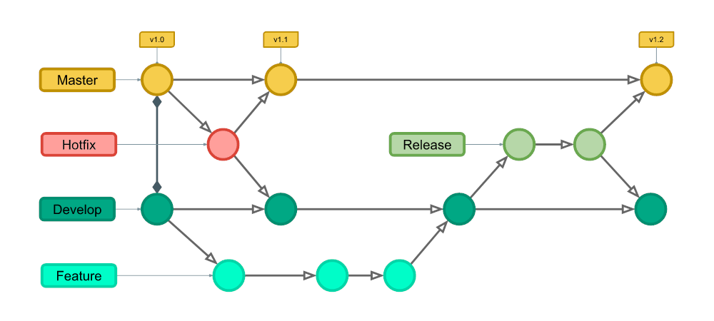
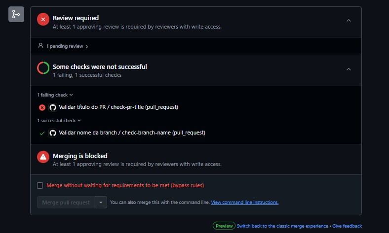

<div align="center">
  <a href="https://www.inteli.edu.br/">
    
  </a>
</div>

<br>

# Nome do Projeto: Gallaudet

# Nome do Grupo: ApoiaEdu

## Integrantes:

- <a href="https://www.linkedin.com/in/anna-riciopo/">Anna Giulia Marques Riciopo</a>  
- <a href="https://www.linkedin.com/in/danielaraujogonncalves/">Daniel Augusto de Araujo Gonçalves</a>  
- <a href="https://www.linkedin.com/in/joao-souza-campos/">João Victor de Souza Campos</a>  
- <a href="https://www.linkedin.com/in/lucas-brasil9/">Lucas Paiva Brasil</a>  
- <a href="https://www.linkedin.com/in/natalycunha/">Nataly de Souza Cunha</a>  
- <a href="https://www.linkedin.com/in/otavio-vasc/">Otávio de Carvalho Vasconcelos</a>  
- <a href="https://www.linkedin.com/in/thiagogomesalmeida/">Thiago Gomes de Almeida</a>

## Sumário

- [1. Introdução](#1-introdução)  
- [2. Estrutura de Arquivos e Pastas](#2-estrutura-de-arquivos-e-pastas)  
  - [2.1 Nome de Arquivos](#21-nome-de-arquivos)  
  - [2.2 Estrutura de Diretórios](#22-estrutura-de-diretórios)  
    - [2.2.1 Princípios Gerais](#221-princípios-gerais)  
    - [2.2.2 Estrutura de Diretórios](#222-estrutura-de-diretórios)  
    - [2.2.3 Observações Finais](#223-observações-finais)  
- [3. Política de Branches](#3-política-de-branches)  
  - [3.1 Visão Geral do Gitflow](#31-visão-geral-do-gitflow)  
  - [3.2 Estrutura de Branches](#32-estrutura-de-branches)  
    - [3.2.1 Branch de Desenvolvimento e de Documentação](#321-branch-de-desenvolvimento-e-de-documentação)  
    - [3.2.2 Diretrizes de Uso das Branches](#322-diretrizes-de-uso-das-branches)  
- [4. Políticas de Commit](#4-políticas-de-commit)  
  - [4.1 Descrição de Commits](#41-descrição-de-commits)  
- [4.1 Descrição de Commits](#41-descrição-de-commits)
- [5. Validadores de Commit e Nome de Branch](#5-validadores-de-commit-e-nome-de-branch)  
- [6. Política de Push e Pull Requests](#6-política-de-push-e-pull-requests)  
  - [6.1 Políticas de Push](#61-políticas-de-push)  
  - [6.2 Políticas de Pull Requests (PR)](#62-políticas-de-pull-requests-pr)  
    - [6.2.1 Nome de Pull Requests](#621-nome-de-pull-request)  
    - [6.2.2 Padrão de Escrita dos Pull Requests](#622-padrão-de-escrita-dos-pull-requests)  
    - [6.2.3 Resolução de Conflitos](#623-resolução-de-conflitos)  
    - [6.2.4 Correção de erros de validação no PR](#624-correção-de-erros-de-validação-no-pr)  
- [7. Padrão para Imagens](#6-padrão-para-imagens)  
- [8. Referências](#7-referências)  

---

## 1. Introdução
&ensp; Este documento estabelece diretrizes claras para boas práticas no desenvolvimento de software, garantindo organização e qualidade do código. Todos os membros da equipe devem seguir as instruções definidas.

---

## 2. Estrutura de Arquivos e Pastas

### 2.1 Nome de Arquivos
- **Formato:** `snake_case` (sempre em inglês).
- **Regra:** Utilize nomes descritivos e curtos, evitando espaços e caracteres especiais.
- **Exemplo:**
  ```
  file_name.txt
  user_data.json
  ```

### 2.2 Estrutura de Diretórios
&ensp; A estrutura de diretórios do projeto deve ser organizada de forma modular, mantendo um equilíbrio entre granularidade e simplicidade. O objetivo é garantir fácil navegação, evitando a criação excessiva de diretórios desnecessários.

#### 2.2.1 Princípios Gerais  
1. **Organização por contexto:** Agrupar arquivos que compartilham um mesmo propósito dentro de uma estrutura coesa.
2. **Evitar diretórios desnecessários:** Só crie uma pasta quando houver mais de um arquivo relacionado a um mesmo contexto.
3. **Facilidade de localização:** Cada arquivo deve estar no diretório correspondente ao seu escopo funcional.

#### 2.2.2 Estrutura de Diretórios  

- **Arquivos de código:**
  - No diretório `pages/`, os arquivos `.tsx` das páginas ficam diretamente na pasta.
  - Caso uma página possua múltiplos arquivos auxiliares (como componentes específicos), uma pasta com o nome da página deve ser criada.
  - Exemplo:
    ```
    pages/home.tsx  
    pages/dashboard.tsx  
    pages/profile/index.tsx  # Criado porque profile possui mais de um arquivo
    pages/profile/avatar.tsx
    pages/profile/settings.tsx
    ```

- **Assets para documentação:**
  - Os assets utilizados na documentação devem ser organizados por **seções**.
  - Caso um tópico exija mais de um asset, deve-se criar uma **pasta dedicada**.
  - Exemplo:
    ```
    assets/section4/swot_analysis.png  
    assets/section4/4.1.6_personas/persona_pedro.png  
    assets/section4/4.1.6_personas/persona_paulo.png  
    ```

- **Componentes reutilizáveis:**
  - Os componentes de uso geral devem ser armazenados em `components/`.
  - Se um componente tiver arquivos auxiliares (ex.: estilos, testes), deve-se criar uma pasta para ele.
  - Exemplo:
    ```
    components/button.tsx  
    components/modal/index.tsx  # Criado porque modal possui múltiplos arquivos
    components/modal/styles.module.css  
    components/modal/modal_header.tsx  
    ```

#### 2.2.3 Observações Finais 
- Não criar pastas com um único arquivo dentro.
- Arquivos relacionados devem ser agrupados de maneira lógica.
- A estrutura deve ser modular, mas sem exageros na profundidade das pastas.

---

## 3. Política de Branches

### 3.1 Visão Geral do Gitflow
&ensp; O Gitflow é um modelo de branching que melhora o fluxo de trabalho no Git, organizando o desenvolvimento em diferentes branches. Ele auxilia no controle de versões e na colaboração eficiente entre desenvolvedores. A estrutura do Gitflow prevê branches específicas para desenvolvimento contínuo, correção de bugs e lançamentos.

<div align="center">
  <sub>Figura 1 - Estrutura do Gitflow</sub> <br>

  

  <sup>Fonte: <a href="https://www.alura.com.br/artigos/git-flow-o-que-e-como-quando-utilizar">Alura</a>.</sup>
</div>

&ensp; Esse diagrama ilustra como as diferentes branches interagem dentro do fluxo de trabalho do Gitflow. A branch `main` contém a versão estável do código, enquanto a `develop` serve como base para novas funcionalidades. As branches `feature`, `release`, `hotfix` e `bugfix` têm papéis específicos para garantir um ciclo de desenvolvimento organizado e eficiente.

### 3.2 Estrutura de Branches
Padrão de Nomenclatura das Branches:

- **Estrutura Geral:**  
  ```
  [tipo de branch]/[finalidade]/[nome-da-branch]
  ```

**Tipos de branch:**

> **main**: Contém o código pronto para produção.

> **develop**: Integração contínua das novas funcionalidades em desenvolvimento.

> **feature/[nome-da-feature]**: Para desenvolvimento de novas funcionalidades. Exemplo: `feature/integration_api`

> **bugfix/[nome-do-bug]**: Para correção de bugs. Exemplo: `bugfix/correct_login`

> **release/[versao]**: Preparação para lançamento de uma nova versão. Exemplo: `release/v1.0.0`

> **hotfix/[nome-do-hotfix]**: Correção urgente diretamente na produção. Exemplo: `hotfix/fix_bug_in_production`

#### 3.2.1 Branch de desenvolvimento e de documentação
&ensp; No contexto acadêmico, recebemos muitas demandas de documentação e, para isso, faz-se necessário a criação de um tipo extra de branch cujo gitflow não prevê. Abaixo está melhor detalhado este aspecto: 
- **`docs`** (documentação):  
  - **Padrão:** O nome deve ter o prefixo `docs`, seguido pela **seção e o título** a que a documentação se refere.  
  - **Exemplos:**  
    ```
    docs/2.1-propostas_e_solucoes  
    docs/4.1.2-analise_swot 
    ```

- **`dev`** (desenvolvimento):  
  - **Padrão:** Utiliza-se os tipos normais de branch do Gitflow.  
  - **Exemplos:**  
    ```
    bugfix/correct_login  
    feature/api_authentication  
    ```

#### 3.2.2 Diretrizes de Uso das Branches
- Cada nova funcionalidade deve ser desenvolvida em uma branch de feature criada a partir da branch develop.
- Os nomes de branch devem seguir os padrões de nomenclaturas de arquivos utilizando sempre o formato em `snake_case` e sempre em inglês.
- Commits diretos na branch main são proibidos!
- Travas foram adicionados no GitHub para impedir commits diretos na main e na develop, além de pushs diretos para main e develop.

---

## 4. Políticas de Commit
- Seguir o padrão "Conventional Commits" para manter um histórico organizado. *Foram adicionados scripts que validam se as mensagens possuem as tags do Conventional Commits.*
- As mensagens devem ter no máximo 50 caracteres. *O script também valida isso.*
- Commits devem ser frequentes e descritivos.
- Proibido o uso de mensagens vagas como "melhorias".
- Foram adicionadas restrições no GitHub para impedir commits diretos na main e develop.

### 4.1 Descrição de Commits  
&ensp; A descrição de commits deve indicar de forma clara o que a alteração faz. Use frases curtas no **presente do indicativo**, pensando no efeito que o commit causa, como se começasse com: **"Se aplicado, este commit..."**. 

- **Padrão de Formatação:**  
  ```
  [tipo]: [descrição breve do que foi alterado]
  ```
- **Tipos mais comuns de commit:**  
  - `feat`: Adição de uma nova funcionalidade  
  - `fix`: Correção de um bug  
  - `refactor`: Refatoração de código sem alterar funcionalidade  
  - `style`: Alterações de estilo ou formatação (sem impacto funcional)  
  - `perf`: Otimizações de performance  
  - `test`: Adição ou atualização de testes  
  - `docs`: Alterações na documentação  
  - `chore`: Tarefas auxiliares (como atualização de dependências)

- **Exemplos:**  
  ```
  feat(client-list/filter): adiciona filtro por data na listagem de clientes  

  fix: corrige erro de validação no formulário de cadastro 

  refactor: reorganiza funções de utilidade em um arquivo separado  
  
  test(auth/login): adiciona testes unitários para o componente de login  

  style: remove espaços em branco no main.css  

  docs: adiciona seção de exemplos na documentação da API  

  chore(deps/build): atualiza dependências do projeto  

  perf: otimiza consulta de clientes para reduzir o tempo de resposta  
  ```

**Observação:** Se necessário, adicione comentários adicionais na descrição longa do commit (usando `git commit -m` e `-m` para múltiplas linhas).

---

## 5. Validadores de Commit e Nome de Branch

Para garantir a conformidade com as boas práticas de commits e nomenclatura de branches, utilizamos quatro scripts que realizam validações antes de permitir um commit, merge ou push:

- **`commit-msg`**: Valida se a mensagem de commit segue o padrão semântico estabelecido e se respeita o limite de caracteres.
- **`pre-push`**: Valida se o nome da branch segue o padrão definido pela política de branches.
- **`pre-commit`**: Impede commits diretos nas branches protegidas (`main` e `develop`).
- **`pre-merge-commit`**: Bloqueia merges diretos para `main` e `develop`, garantindo que a integração de código ocorra apenas via Pull Request.

### Como configurar os validadores
1. Copie os arquivos `commit-msg`, `pre-push`, `pre-commit` e `pre-merge-commit` da pasta `git_validators`. *Observação: estes arquivos estão disponíveis na pasta `git_validators`, esta, por sua vez, está presente no mesmo diretório que este presente arquivo.*
2. Cole-os na pasta `.git/hooks` do repositório local.
3. Dê permissão de execução aos arquivos:
   ```sh
   chmod +x .git/hooks/commit-msg
   chmod +x .git/hooks/pre-push
   chmod +x .git/hooks/pre-commit
   chmod +x .git/hooks/pre-merge-commit
   ```
   *Observação: execute esses comandos no `Git Bash`*

### Importância dos validadores
Esses validadores garantem que:
- Todas as mensagens de commit sigam um padrão claro e padronizado.
- Nenhuma branch com um nome fora do padrão seja empurrada para o repositório remoto.
- Nenhum commit seja feito diretamente nas branches protegidas (`main` e `develop`).
- Nenhum merge direto seja realizado para `main` e `develop` sem passar por um Pull Request.
- O histórico do repositório permaneça organizado e de fácil leitura.
- As boas práticas do GitFlow sejam seguidas rigorosamente, garantindo um fluxo de trabalho eficiente e seguro.

O uso desses validadores ajuda a manter a consistência e a qualidade do código, além de evitar problemas futuros na gestão do projeto.

---

## 6. Política de Push e Pull Requests

### 6.1 Políticas de Push
- Push direto para `main` e `dev` é proibido. *Observação: os vallidadores impedem isso, mas também exitem pipelines para evitar.*
- Todas as mudanças devem passar por Pull Request.
- Foram adicionadas travas no GitHub para impedir push direto na main e develop, exigindo pull requests para qualquer mudança.

### 6.2 Políticas de Pull Requests (PR)
- Todo PR deve ser revisado por pelo menos um membro. *Foi adicionada uma configuração no Github que garante isso.*
- Todas as discussões abertas devem ser resolvidas antes do merge. *Foi adicionada uma configuração no Github que garante isso.*
- Todo PR deve passar por testes automatizados.
- Após o merge de um PR, a branch correspondente deve ser excluída para manter o repositório organizado e evitar acúmulo de branches obsoletas.

#### 6.2.1 Nome de Pull Request
- **Formato:** `[tipo]: [descrição breve] #[número-da-task]`
- **Exemplo:**
  ```
  feat: adiciona filtro por data na listagem de clientes #21  
  ```

#### 6.2.2 Padrão de Escrita dos Pull Requests
&ensp; Cada Pull Request deve conter uma lista das mudanças implementadas. Exemplo:

```markdown
# Changelog

- Implementa autenticação de usuários com JWT;
- Adiciona página de cadastro com validação de dados;
- Corrige bug no carregamento de perfis de usuário;
- Melhora a responsividade do layout na tela de login.

closes: [#123](link da task no trello), [#124](link da task no trello).
```

#### 6.2.3 Resolução de Conflitos
&ensp; Caso existam conflitos entre branches, recomenda-se que a resolução seja feita localmente no VS Code, utilizando a ferramenta nativa de resolução de conflitos, que é mais intuitiva e eficiente do que a do GitHub. O processo recomendado é o seguinte:

1. Antes do PR ser aceito, caso haja conflitos, realizar um `git pull` para garantir que a branch local está atualizada com as últimas mudanças.
2. Certificar-se de que está na branch em que o PR foi aberto e executar `git merge [branch-de-destino]` para trazer as alterações mais recentes e verificar os conflitos.
3. Utilizar a ferramenta de resolução de conflitos do VS Code para resolver as diferenças de forma visual e simplificada.
4. Após resolver os conflitos, concluir o merge e realizar um commit confirmando as alterações.
5. Subir as mudanças (`git push`) para que o PR possa ser revisado e aceito sem conflitos.

Essa abordagem facilita a resolução de conflitos e evita complicações ao tentar resolver diretamente na interface do GitHub.

#### 6.2.4 Correção de erros de validação no PR
Existem pipelines configurados para validar se o título do PR e o nome da branch seguem os padrões especificados.

A seguir, está inserida uma imagem de exemplo, onde a validação de título do PR falhou, mas a validação do nome da branch foi bem-sucedida. 

<div align="center">
  <sub>Figura 2 - Falha na Validação de título de PR</sub> <br>

  

  <sup>Fonte: Material produzido pelos autores (2025).</sup>
</div>

Caso um PR seja bloqueado por erro no nome da branch ou no título do PR, siga as instruções abaixo, dependendo do tipo de erro.

#### Caso o erro seja no Título do PR
Se o erro for causado pelo título do PR não seguir o padrão esperado:
1. Feche o PR atual sem fazer merge.
2. Abra um novo Pull Request **com o título correto**.
   
**Nota:** Não é necessário alterar o nome da branch. Apenas corrija o título e suba o novo PR.

#### Caso o erro seja no Nome da Branch
Se o erro for devido ao nome da branch não seguir o padrão esperado:
1. Feche o PR atual sem fazer merge.
2. Renomeie a branch localmente:
   ```sh
   git branch -m nome-antigo nome-correto
   ```
3. Delete a branch remota antiga:
   ```sh
   git push origin --delete nome-antigo
   ```
4. Suba a branch renomeada:
   ```sh
   git push origin nome-correto
   ```
5. Abra um novo Pull Request com a branch correta e o título adequado.

---

## 7. Padrão para Imagens
- Evitar imagens grandes desnecessariamente.
- Sempre tilizar JPG para imagens que nãp precisam de camada de transparência.
- Imagens acima de 1MB devem ser comprimidas (salvo em casos de casos de GIF).
- Para imagens sem tantos detalhes, recomenda-se o uso de SVG.

---

## 8. Referências
- Conventional Commits: https://www.conventionalcommits.org/en/v1.0.0/
- GitFlow: https://nvie.com/posts/a-successful-git-branching-model/
- GitHub/iuricode: https://github.com/iuricode/padroes-de-commits
- Alura - GitFlow: https://www.alura.com.br/artigos/git-flow-o-que-e-como-quando-utilizar